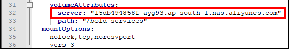
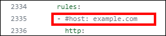
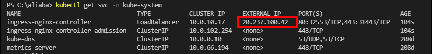

# Deploying Bold BI and Bold Reports in Alibaba Cloud Kubernetes (ACK) Cluster
This section provides instructions on how to deploy Bold BI and Bold Reports in an Alibaba Cloud Kubernetes (ACK) cluster. Please follow the documentation below to successfully deploy these applications.

# Deployment Methods

There are two ways to deploy Bold BI and Bold Reports on the Kubernetes cluster. Please refer to the following documents for Bold BI and Bold Reports deployment:

* [Deploy Bold BI and Bold Reports using Kubectl](#deploy-bold-bi-and-bold-reports-using-kubectl)
* [Deploy Bold BI and Bold Reports using Helm](#bold-bi-auto-deployment-using-helm)

Please click on the respective links to access the detailed documentation for each deployment method.

# Deploy Bold BI and Bold Reports using Kubectl

The following steps will guide you through the process of deploying Bold BI and Bold Reports using kubectl in an Alibaba Cloud Kubernetes (ACK) cluster.

## Deployment prerequisites

The following requirements are necessary to deploy the Bold BI and Bold Reports solution using kubectl:

* [Install Kubectl](https://kubernetes.io/docs/tasks/tools/#kubectl): Make sure you have kubectl installed on your local machine to facilitate the deployment process.
* [NAS File System](pre-requisites.md#file-storage): Set up a NAS file system to store the required data for Bold BI and Bold Reports.
* [Create and connect a ACK cluster](pre-requisites.md#create-a-cluster): Create and connect an ACK cluster in Alibaba Cloud that will host the Bold BI and Bold Reports deployment.
* Load Balancing- [Nginx](https://kubernetes.github.io/ingress-nginx/deploy/) : By default, an Alibaba Cloud Kubernetes (ACK) cluster has Nginx already installed in the kube-system namespace, so there is no need to manually install it. The Nginx Ingress Controller is available and can be utilized to enable load balancing for your Bold BI and Bold Reports deployment.

Please ensure that you have fulfilled these prerequisites before proceeding with the deployment.

## Steps for Bold BI and Bold Reports auto deployment using kubectl.

1. Download the deployment file from [here](https://raw.githubusercontent.com/boldbi/boldbi-kubernetes/239310-Bold-BI-Alibaba-Cloud-Kubernetes-(ACK)-Doc/deploy/deploy/common_ack_deploy.yaml) to deploy Bold BI and Bold Reports on AKS.

2. Navigate to the folder where the deployment files were downloaded in **Step 1**.

3. Follow the documentation provided at [this link](https://www.alibabacloud.com/help/en/nas/latest/create-a-nas-file-system) to create a `file system` in Alibaba Cloud.

4. Once the file system is created, locate and click on the cube icon. This will allow you to view the mount target hostname. Take note of the mount target hostname, as you will need it for mounting the file system with our application.

   

5. Open the **common_ack_deploy.yaml** file and replace the <host_name_of_mount_target> placeholder with the actual mount target hostname noted in the previous step.

    

6. If you have a DNS to map with the application, proceed to the next steps, otherwise, skip to **Step 10**. 

7. Uncomment the host value and replace your DNS hostname with `example.com` in **common_ack_deploy.yaml** file in line **2335**.

      

8. If you have the SSL certificate for your DNS and need to configure the site with it, follow these steps, otherwise, skip to **Step 10**.

9. Now, uncomment the `tls` section and replace your DNS hostname with `example.com` in ingress spec and save the file.

       

10. Now, run the following command to get the External IP address.

      ```sh
      kubectl get svc -n kube-system
      ```
      Repeat the above command till you get the IP address in EXTERNAL-IP tab as shown in the following image. 
      

14. Note the EXTERNAL-IP address and map it to your DNS if you have added it in the **common_ack_deploy.yaml** file. If you do not have a DNS, use the EXTERNAL-IP address to access the application.

15. Replace your DNS or EXTERNAL-IP address in `<application_base_url>` place.

    Ex:  `http://example.com`, `https://example.com`, `http://<external_ip_address>`
    
     
    
16. Read the optional client library license agreement from the following link.

    [Consent to deploy client libraries](../docs/consent-to-deploy-client-libraries.md)
    
17. By default, all client libraries for Bold BI and Bold Reports will be installed in Kubernetes. However, you can overwrite them by specifying the required libraries as a comma-separated list in the environment variable noted from the above link.

     

18. Now, run the following commands to deploy Bold BI and Bold Reports in your kubernetes cluster.

    ```sh
    kubectl apply -f deploy.yaml
    ```

19. 9.  Run the following command to create a TLS secret with your SSL certificate.

```sh
kubectl create secret tls bold-tls -n bold-services --key <key-path> --cert <certificate-path>
```

19. Use the following command to get the pods status.

     ```sh
    kubectl get pods -n bold-services
     ```
     

20. Wait till you see the applications in running state. Then, use your DNS or EXTERNAL-IP address you got from the following command to access the application in the browser.
    
     ```sh
    kubectl get ingress -n bold-services
    ```
    

     
    
21. Please refer to the following link for more details on configuring the application startup.
    
    https://help.boldbi.com/embedded-bi/application-startup


# Bold BI and Bold Reports Auto Deployment using Helm

This chart installs [Bold BI and Bold Reports](https://www.boldbi.com/) on Kubernetes. You can create Kubernetes cluster in cloud cluster providers(GKE,AKS and EKS). Please follow the below documentation for Bold BI and Bold Reports deployment in a specific cloud environments.

## Deployment prerequisites

* [Install Helm](https://helm.sh/docs/intro/install/) to deploy Bold BI and Bold Reports using Helm.
* [File Storage](../docs/pre-requisites.md#file-storage)
* [Create and connect a cluster](../docs/pre-requisites.md#create-a-cluster)
* [Load Balancing](../docs/pre-requisites.md#load-balancing)

**Note:** Note the [Ingress IP address](docs/pre-requisites.md#get-ingress-ip) and map it with a DNS to craft values.yaml when installing Bold BI and Bold Reports with helm chart.

## Get Repo Info

1. Add the Bold BI and Bold Reports helm repository.

```console
helm repo add boldbi https://boldbi.github.io/boldbi-kubernetes
helm repo update
```

2. View charts in repo.

```console
helm search repo boldbi

NAME            CHART VERSION   APP VERSION     DESCRIPTION
boldbi/boldbi   6.5.8           6.5.8         Embed powerful analytics inside your apps and t...
```

_See [helm repo](https://helm.sh/docs/helm/helm_repo/) for command documentation._

## Create Namespace

Run the following command to create the namespace where the Bold BI and Bold Reports resources will be deployed in the Kubernetes cluster. The default namespace is <i>bold-services</i>.

```console
kubectl create ns bold-services
```

## Install Chart

For the Helm chart, you need to craft a `values.yaml` file. So download the values.yaml file from [here](https://raw.githubusercontent.com/boldbi/boldbi-kubernetes/main/helm/custom-values/values.yaml) and make needed changes based on your cluster provider.

The following table allows you to craft the values.yaml file with required values for Bold BI and Bold Reports deployment. so please read the description carefully and enter the values in values.yaml file.

<br/>

<table>
    <tr>
      <td>
       <b>Name</b>
      </td>
      <td>
       <b>Description</b>
      </td>
    </tr>
    <tr>
      <td>
       namespace
      </td>
      <td>
       The namespace in which the Bold BI and Bold Reports resources will be dpleoyed in the kubernetes cluster.<br/>
       The default namespace is <i>bold-services</i>
      </td>
    </tr>
    <tr>
      <td>
       appBaseUrl *
      </td>
      <td>
       Domain with http/https protocol.
       <br/>
       Ex: `http://example.com`, `https://example.com`
       <br/>
       Follow the <a href='configuration.md#ssl-configuration'>SSL Configuration</a> to configure SSL certificate for https protocol.
      </td>
    </tr>
    <tr>
      <td>
       optionalLibs
      </td>
      <td>
       These are the client libraries used in Bold BI and Bold Reports by default.<br/>
       '<i>mongodb,mysql,influxdb,snowflake,oracle,google,clickhouse</i>'<br/>
       Please refer to <a href='docs/configuration.md#client-libraries'>Optional Client Libraries</a> section to know more.
      </td>
    </tr>
    <tr>
      <td>
       clusterProvider
      </td>
      <td>
       The type of kubernetes cluster provider you are using.<br/>
       The supported values are '<i>gke,eks,ack and aks,</i>'
       Please refer to <a href='configuration.md#cluster-provider'>Cluster Provider</a> section to know more.
      </td>
    </tr>
    <tr>
      <td>
       persistentVolume*
      </td>
      <td>
       This is a file storage information to store the shared folders for application usage.
       Please refer to <a href='configuration.md#persistent-volume'>this</a> section to know more on how to set Persistant Volumes for Bold BI and Bold Reports.
      </td>
    </tr>
    <tr>
      <td>
       loadBalancer
      </td>
      <td>
       Currently we have provided support for Nginx and Istio as Load Balancers in Bold BI and Bold Reports. Please refer to <a href='docs/configuration.md#load-balancing'>this</a> section for configuring Load balancer for Bold BI and Bold Reports.
      </td>
    </tr>
    <tr>
      <td>
       autoscaling
      </td>
      <td>
       By default autoscaling is enabled in Bold BI and Bold Reports. Please refer to <a href='configuration.md#auto-scaling'>this</a> section to configure autoscaling in Bold BI and Bold Reports.
      </td>
    </tr>
    <tr>
      <td>
       bingMapWidget
      </td>
      <td>
       Please refer to <a href='configuration.md#bing-map-widget'>this</a> section to configure Bing Map Widget in Bold BI and Bold Reports.
      </td>
    </tr>
    <tr>
      <td>
       customLocalePath
      </td>
      <td>
       Custom locale file path for Localization.
       Please refer to <a href='configuration.md#custom-locale-path'>this</a> section to configure Custom Locale Path in Bold BI and Bold Reports.
      </td>
    </tr>
    </table>
<br/>

> **Note:** Items marked with `*` are mandatory fields in values.yaml.

Run the following command to delpoy Bold BI and Bold Reports in your cluster.

```console
helm install [RELEASE_NAME] boldbi/boldbi -f [Crafted values.yaml file]
```
Ex:  `helm install boldbi boldbi/boldbi -f my-values.yaml`

_See [helm install](https://helm.sh/docs/helm/helm_install/) for command documentation._

## Upgrade

Run the following command to get the latest version of the Bold BI and Bold Reports helm chart.

```console
helm repo update
```

Run the following command to apply changes in your Bold BI and Bold Reports release or upgrade Bold BI and Bold Reports to the latest version.

```console
helm upgrade [RELEASE_NAME] boldbi/boldbi -f [Crafted values.yaml file]
```

Ex:  `helm upgrade boldbi boldbi/boldbi -f my-values.yaml`

## Uninstall Chart

```console
helm uninstall [RELEASE_NAME]
```
Ex:  `helm uninstall boldbi`

This removes all the Kubernetes components associated with the chart and deletes the release.

_See [helm uninstall](https://helm.sh/docs/helm/helm_uninstall/) for command documentation._
