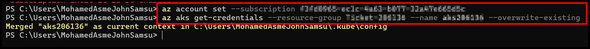
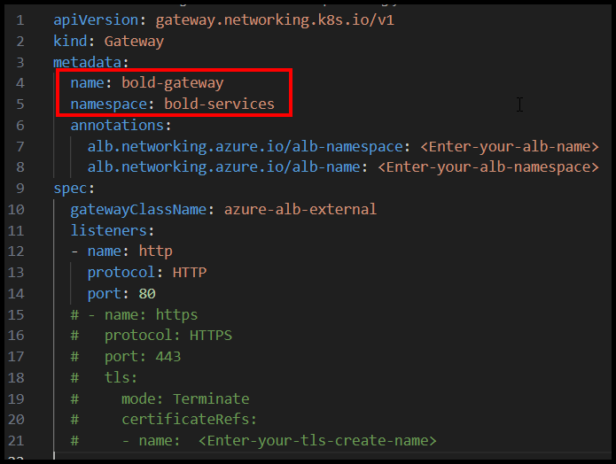
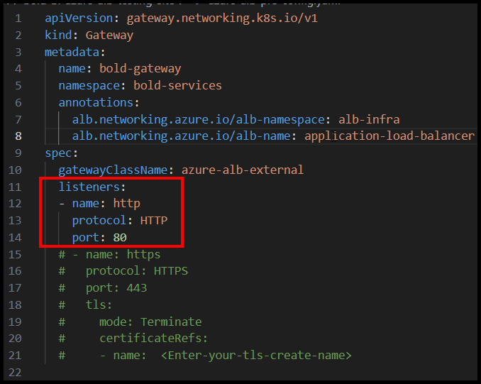
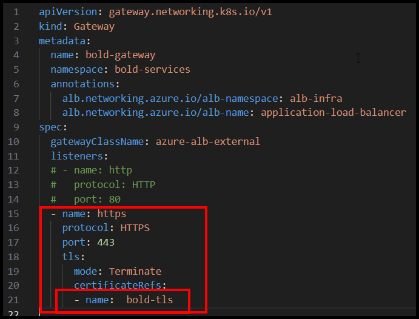
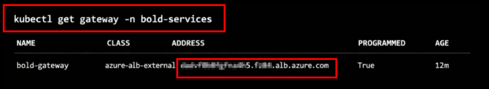
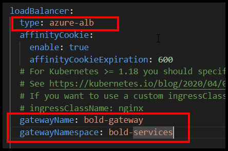
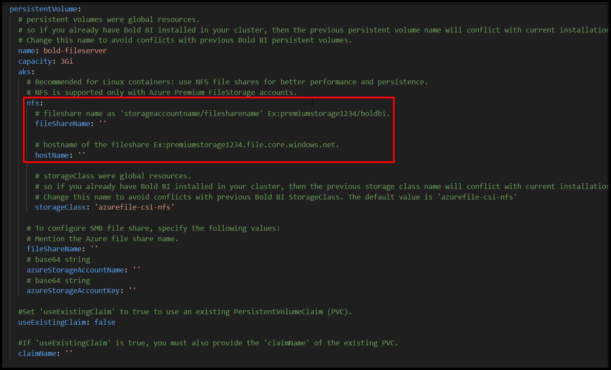
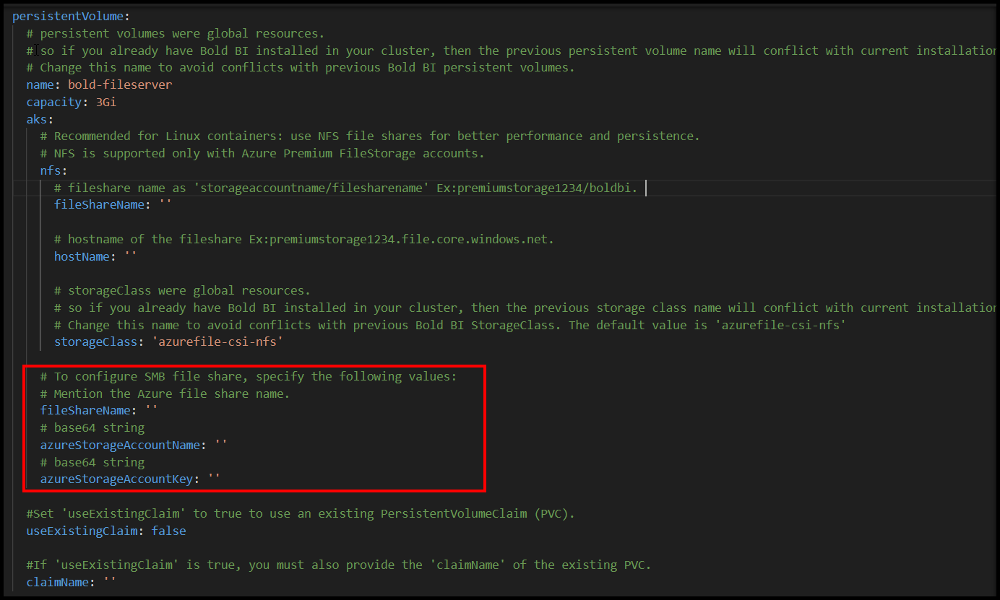

# Deploying Bold BI on AKS with Azure ALB Gateway (Using Helm Chart)
A Complete Step‑by‑Step Deployment Guide

---

# Introduction
This guide explains how to deploy **Bold BI** on an **Azure Kubernetes Service (AKS)** cluster using the **Azure Application Load Balancer (ALB)** Gateway API and Helm.

---

# Prerequisites
 Before starting the deployment, ensure the following are in place:
## 1. AKS Cluster Setup:
* Create a new AKS cluster or update an existing one to support Azure ALB Controller. Refer to the official Microsoft documentation for detailed instructions

* Documentation: [Deploy Application Gateway for Containers ALB Controller add-on](https://learn.microsoft.com/en-us/azure/application-gateway/for-containers/quickstart-deploy-application-gateway-for-containers-alb-controller-addon)

* This step enables the ALB ingress controller, which is essential for routing traffic to your Bold BI application.

## 2. Azure Storage Account:
* Set up an Azure Files storage account for persistent storage in AKS. This is required for Bold BI's data persistence. Follow the guidelines in the Bold BI Kubernetes repository. [Documentation Link](https://github.com/boldbi/boldbi-kubernetes/blob/main/helm/docs/pre-requisites.md#aks-file-storage)

* Note the storage account details (e.g., account name, file share name, and access key), as they will be used later for persistent volumes.

## 3. Helm Installation:
* Install Helm on your local machine to manage Kubernetes charts.

* Download and install from the official Helm documentation: [Helm Installation Guide](https://helm.sh/docs/intro/install/)

* Verify the installation by running `helm version` in your terminal.

## 4. Additional Tools:
* Azure CLI (az) installed and authenticated.

* kubectl installed and configured.

* Optional: A domain name for mapping to the ALB Gateway's CNAME.
---

# Deployment Steps
Follow these steps in sequence to deploy Bold BI.

## 1. Connect to Your AKS Cluster
Connect your local machine to the AKS cluster using Azure CLI. This allows you to run kubectl commands against the cluster.
```sh
az account set --subscription <your-subscription-id>

az aks get-credentials --resource-group <resource-group-name> --name <cluster-name> --overwrite-existing
```
* Replace `<your-subscription-id>`, `<resource-group-name>`, and `<cluster-name> ` with your actual values.

* The `--overwrite-existing` flag ensures the kubeconfig is updated even if it already exists.



Verify the connection:
```sh
kubectl get nodes
```
This should list the nodes in your AKS cluster.

## 2. Download the Azure ALB Pre-Config File
Download the pre-configuration YAML file for Azure ALB integration with Bold BI. Use the following command or download directly from the URL
```sh
curl -O https://raw.githubusercontent.com/boldbi/boldbi-kubernetes/refs/heads/main/deploy/azure-alb-pre-config.yaml
```

## 3. Create Namespace
Create a dedicated Kubernetes namespace for the Bold BI deployment. This isolates resources and improves manageability.
```sh
kubectl create namespace <namespace-name>
```
* Replace `<namespace-name>` with your chosen name (e.g., bold-services).

## 4. Configure SSL (Optional for HTTPS)
If you plan to host Bold BI with SSL/TLS (recommended for production), create a TLS secret in the namespace.

```sh
kubectl create secret tls bold-tls -n <namespace-name> --key <key-path> --cert <certificate-path>
```

* Replace `<key-path>` and `<certificate-path>` with the paths to your private key and certificate files.

## 5. Update the Azure ALB Pre-Config File with Namespace and Gateway Details
Edit the azure-alb-pre-config.yaml file to include:
* Your created namespace (`<namespace-name>`).
* A prepared gateway name (e.g., bold-gateway).



Open the file in a text editor and replace placeholders accordingly.

## 6: Update Azure ALB Namespace and Name in Pre-Config File
Further edit azure-alb-pre-config.yaml to specify:

* The Azure ALB namespace.
* The Azure ALB name.


Ensure these match your ALB setup from Prerequisite one.

## 7. Apply ALB Config
For reference:

* HTTP Configuration: Use the basic listener setup.
    
    

* HTTPS (SSL) Configuration: Ensure the TLS secret is referenced.

    

Apply the configured YAML to create the Gateway resources.
```sh
kubectl apply -f azure-alb-pre-config.yaml
```

## 7. Obtain CNAME for Azure Gateway
Retrieve the CNAME for the ALB Gateway, which will be used for DNS mapping.

```sh
kubectl get gateway -n <namespace>
```
* Look for the ADDRESS field in the output, which provides the CNAME.

* Map this CNAME to your custom domain in your DNS provider (e.g., via a CNAME record pointing your domain to the ALB address).




## 8. Download Bold BI AKS Helm Values File
Download the custom values file for the Bold BI Helm chart tailored for AKS.
```sh
curl -O https://raw.githubusercontent.com/boldbi/boldbi-kubernetes/main/helm/custom-values/aks-values.yaml
```
This file contains overrides for the default Helm chart values.

## 9. Update AKS Values File with Gateway Details
Edit aks-values.yaml to include:

* App base URL.
* Update your namespace.

    

* Load Banalncer Balancer type `azure-alb`
* The gateway name created in previous steps.
* The gateway's namespace.

    

## 10. Update AKS Values File with Storage Account Details
Configure persistent volumes in aks-values.yaml using your Azure Storage Account details from Prerequisite 2.

* For use storage account with SMB file share.

    

* For use storage account with NFS file share.

    


## 11. Deploy Bold BI to the AKS cluster using the Helm chart.
```sh
helm install boldbi boldbi/boldbi -f <your-values.yaml> -n <namespace>
```
* Replace `<your-values.yaml>` with the path to your edited aks-values.yaml.
* Replace `<namespace-name>` with your namespace.

## 12. Verify Deployment
```sh
kubectl get pods -n <namespace>
```


Once pods are running, access Bold BI via your mapped domain
