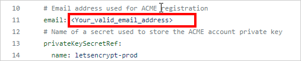
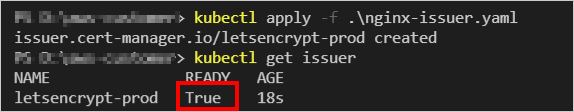
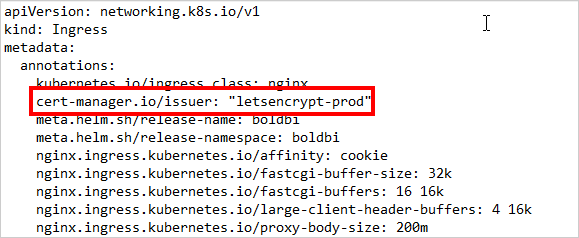
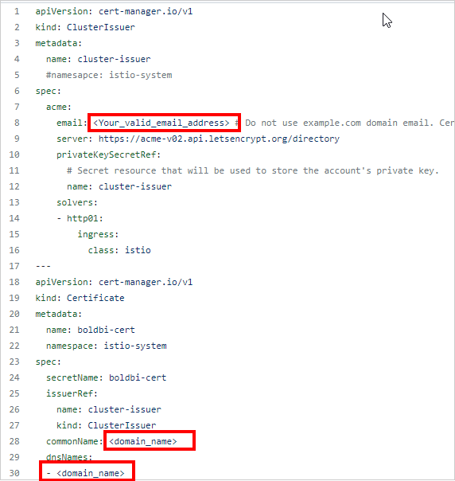
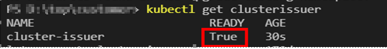
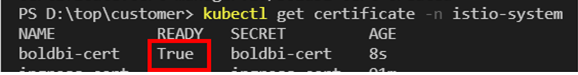
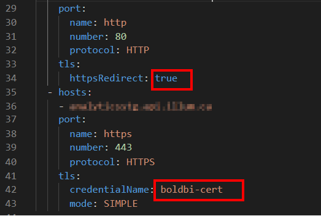

# How TO Manually Configure SSL Using Cert Manager in Bold BI Kubernetes Deployment

This section describe how to manually configure ssl using cert manager on kubernetes. Currently we have provided support for Nginx and Istio as Load Balancers in Bold BI. Please refer the below links for configure ssl based on your load balancer.

* [Configure SSL Using Cert Manager in Bold BI Kubernetes Deployment with Nginx](#configure-ssl-using-cert-mnager-in-bold-bi-kubernetes-deployment-with-Nginx)

* [Configure SSL Using Cert Manager in Bold BI Kubernetes Deployment with Isito](#Configure SSL Using Cert Manager in Bold BI Kubernetes Deployment with istio)

## Configure SSL Using Cert Manager in Bold BI Kubernetes Deployment with Nginx

Follow the below steps to configure ssl when using Nginx load balancer in Bold BI kubernetes deployment.

1. To deploy the Cert-manager in your cluster create a namespace and deploy it using helm or kubectl.
	
	Command for deploy Cert-manager using helm:
	
	```console
	helm install cert-manager jetstack/cert-manager --namespace cert-manager --create-namespace --version v1.10.0 --set installCRDs=true --set global.leaderElection.namespace=cert-manager
	
	```

	Command for deploy Cert-manager using kubectl:
	
	```console
	kubectl create ns cert-manager
	
	kubectl apply -f https://github.com/cert-manager/cert-manager/releases/download/v1.8.2/cert-manager.crds.yaml
	
	kubectl apply -f https://github.com/jetstack/cert-manager/releases/download/v1.8.2/cert-manager.yaml
	```
	
	**Note:** After successfully deployed the Cert-manager Make sure the Cert-manager pods are running state by running the below command `kubectl get pods -n cert-manager`
			
2. Download the <b>nginx-issuer.yaml</b> file from [here](../../ssl-configuration/nginx-issuer.yaml) and replace the <Your_valid_email_address> with valid email id.

	

3. Apply the nginx-issuer.yaml file and ensure whether the issuer is applied successfully by running the following command.

	```console
	kubectl apply -f nginx-issuer.yaml
	
	Kubectl get issuer -n bold-services
	```
	
	

4. By using the following command edit the ingress and include the annotation `cert-manager.io/issuer: "letsencrypt-prod"` as shown below and save the changes.

	```console
	kubectl edit ingress -n bold-services
	```

	

5. After save the above changes you can access the Bold BI site using secure https protocol.If you can't please browse the URL in another private window and check it once again.


## Configure SSL Using Cert Manager in Bold BI Kubernetes Deployment with Istio

Follow the below steps to configure ssl when using Istio load balancer in Bold BI kubernetes deployment.

1. To deploy the Cert-manager in your cluster create a namespace and deploy it using helm or kubectl.

	Command for deploy Cert-manager using helm:
	
	```console
	helm install cert-manager jetstack/cert-manager --namespace cert-manager --create-namespace --version v1.10.0 --set installCRDs=true --set global.leaderElection.namespace=cert-manager
	```
	
	Command for deploy Cert-manager using kubectl:
	
	```console
	kubectl create ns cert-manager
	
	kubectl apply -f https://github.com/cert-manager/cert-manager/releases/download/v1.8.2/cert-manager.crds.yaml
	
	kubectl apply -f https://github.com/jetstack/cert-manager/releases/download/v1.8.2/cert-manager.yaml
	```
		
	**Note:** After successfully deployed the Cert-manager Make sure the Cert-manager pods are running state by running the below command `kubectl get pods -n cert-manager`
	
2. Download the <b>istio-cert-issuer.yaml</b> file from [here](../../ssl-configuration/istio-cert-issuer.yaml) and replace the <Your_valid_email_address> with valid email id and <domain_name> with your domain name which you have used for boldbi deployment.

	

3. Apply the istio-cert-issuer.yaml file and ensure whether the issuer is applied successfully by running the following command.

    ```console
	kubectl apply -f istio-cert-issuer.yaml
	
	Kubectl get issuer -n clusterissuer
	
	Kubectl get certificate -n istio-system
	```
	
	
	
	

4. Edit the Bold BI gateway file with the created secret name by running the following command.

	```console
	Kubectl edit gateway -n bold-services
	```
	

5. After save the above changes you can access the Bold BI site using secure https protocol.If you can't please browse the URL in another private window and check it once again.

