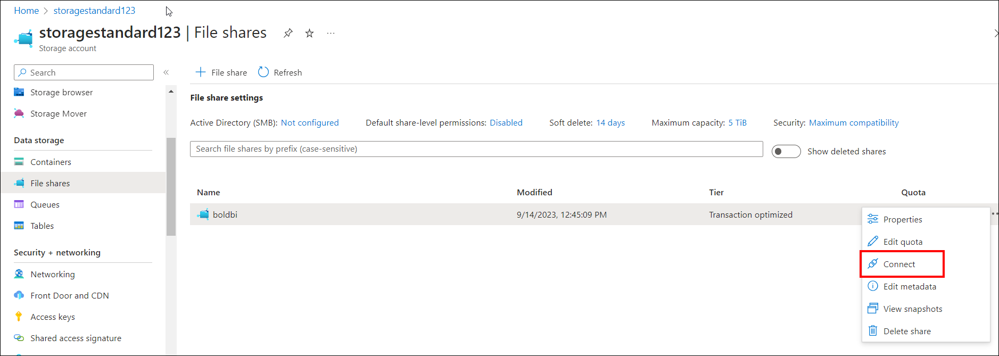
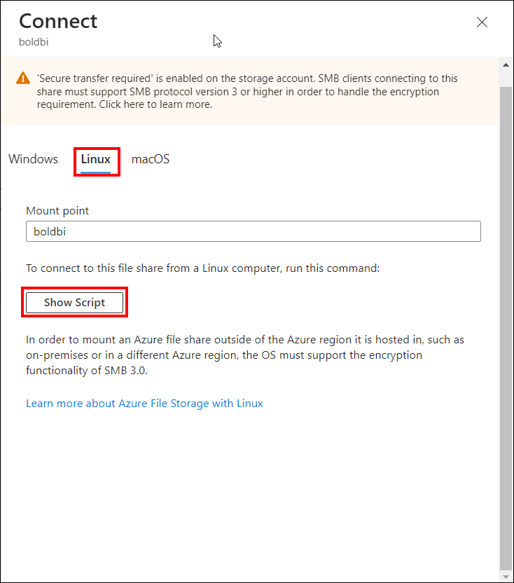
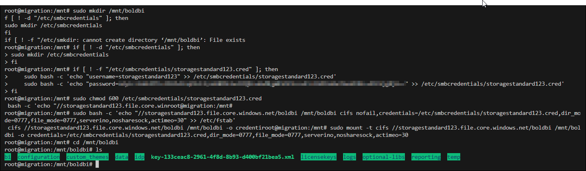
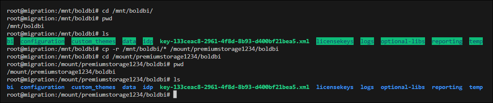
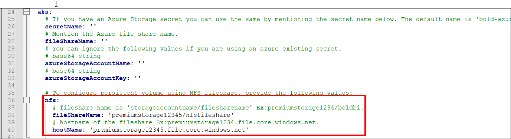

# How to migrate the file share from Azure SMB Fileshare to NFS Fileshare?

This documentation describes how to migrate the file share from Azure SMB Fileshare to NFS Fileshare and deploy Bold BI using the NFS file share.


## Migrating the app_data from an Azure SMB fileshare to an NFS fileshare with the help of a Linux VM.

### Step 1: Stop Bold BI Services.

To prevent any data changes during the migration, temporarily stop the Bold BI services by running the following Helm uninstall command:

```shell
helm uninstall releasename -n namespace
```
### Step 2: Create an NFS Fileshare and Mount it to a Linux VM.

Follow the documentation below to create an NFS fileshare and mount it to a Linux VM:

[Create and Mount an NFS Fileshare on a Linux VM](https://learn.microsoft.com/en-us/azure/storage/files/storage-files-quick-create-use-linux?source=recommendations)

### Step 3: Mount the SMB Fileshare on the Linux VM.

After mounting the NFS fileshare to the Linux virtual machine, you can also mount the SMB fileshare by following these steps:

* Access the storage account and go to the fileshare.

* In the fileshare, click the three dots located on the right edge of the fileshare, and then click "Connect" as shown below.

    

* In the `Connect` panel, switch to `Linux` and click `Show script`and run the script in your Linux VM to mount the SMB fileshare.

    

* After successfully mounting the SMB fileshare in the virtual machine directory, ensure that the app_data is available in the mounted directory. 

    

* You can copy the files to the NFS mounted directory using the `cp` command, like this.

    ```shell
    sudo cp -r smb_fileshare_mounting_dir/* nfs_fileshare_mounting_directory

    Example:
    sudo cp -r /mnt/boldbi/* /mount/premiumstorage1234/boldbi
    ```
    

* Once the data copy is complete, verify the data integrity on the NFS share to ensure that all files and directories were successfully transferred. Then, `unmount` the directories using the umount command.

    ```shell
    umount dir

    Example:
    umount /mnt/boldbi 
    umount /mount/premiumstorage1234/boldbi
    ```   
> **Note:** If you encounter any issues while unmounting the directory and face a "directory busy" issue, please navigate to the root directory using the "cd" command. Then, run the "umount" command to umount. 

* Now, the app_data has been successfully copied from the SMB fileshare to the NFS fileshare.

## Reinstall Bold BI with NFS Fileshare Mounting Using Helm Chart.

### Step 1: Update the values.yaml File.
Download the values.yaml file for [here](https://github.com/boldbi/boldbi-kubernetes/blob/main/helm/custom-values/common-aks-values.yaml) and update the NFS fileshare details by specifying the `fileShareName` and `hostName` in the following fields:

```shell
persistentVolume:
  # persistent volumes were global resources. 
  # so if you already have Bold BI installed in your cluster, then the previous persistent volume name will conflict with current installation.
  # Change this name to avoid conflicts with previous Bold BI persistent volumes.
  name: bold-fileserver
  capacity: 3Gi
  aks:
    # If you have an Azure Storage secret you can use the same by mentioning the secret name below. The default name is 'bold-azure-secret'
    secretName: ''
    # Mention the Azure file share name.
    fileShareName: ''
    # You can ignore the following values if you are using an azure existing secret.
    # base64 string
    azureStorageAccountName: ''
    # base64 string
    azureStorageAccountKey: ''
    
    # To configure persistent volume using NFS fileshare, provide the following values:
    nfs:
      # fileshare name as 'storageaccountname/filesharename' Ex:premiumstorage1234/boldbi.
      fileShareName: ''
      # hostname of the fileshare Ex:premiumstorage1234.file.core.windows.net.
      hostName: ''
```


> **Note:** Ensure you update the `appBaseUrl` and other configuration details in your existing values.yaml file to match your current setup or append the provided persistent volume fields to your existing values.yaml file. Additionally, ensure that the SMB fileshare fields are left empty when configuring NFS.

### Step 2: Install Bold BI with NFS Fileshare.

Following the update of NFS fileshare details in the values.yaml file, execute the Helm install command to install Bold BI with the NFS fileshare:

```shell
helm repo add boldbi https://boldbi.github.io/boldbi-kubernetes

helm repo update

helm install {Releasename} boldbi/boldbi -f values.yaml -n {Namespace}
```
Example:
helm install boldbi bold-common -f values.yaml -n bold-services

> **Note:** To avoid issues with volume mounting, ensure that the AKS cluster and NFS file share are either in the same virtual network or connected through peered virtual networks

### Step 3: Verify the Installation

Ensure the Bold BI site is accessible in your browser after successfully installing Bold BI with the NFS fileshare.

By following these steps, you can seamlessly migrate Bold BI app_data from an Azure SMB fileshare to an NFS fileshare using the Helm Chart.
