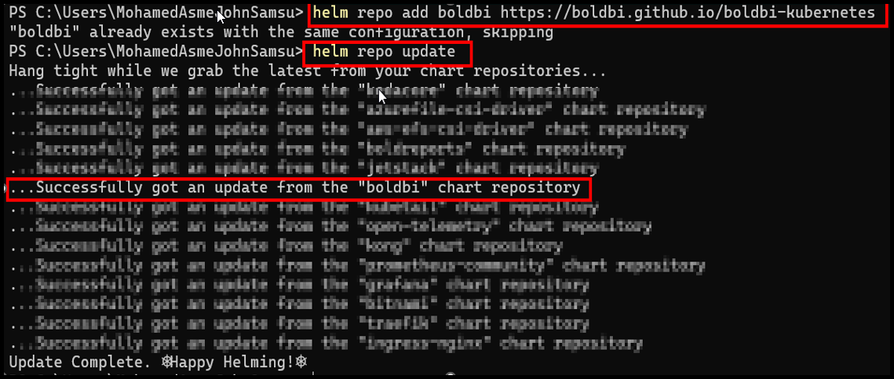
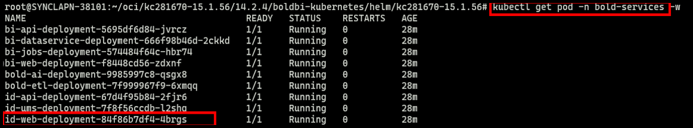
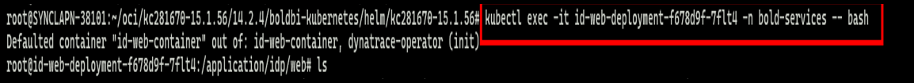
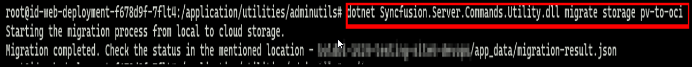
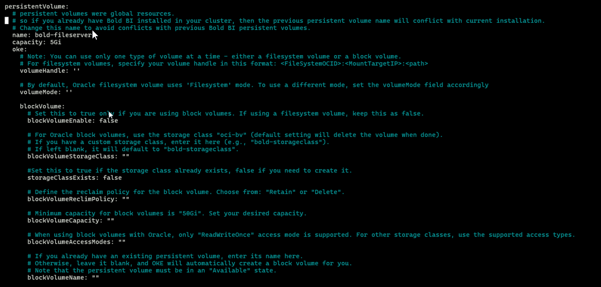
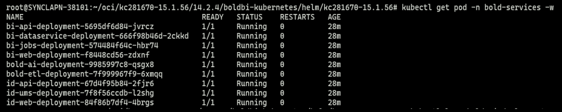

# Bold BI PV to OCI Storage Migration on Kubernetes

This document describes the steps to migrate Bold BI application data from a Persistent Volume (PV) to **OCI Object Storage** on a Kubernetes cluster.

---

## 1. Add the Bold BI Helm Repository
Use the following commands to add and update the Bold BI Helm repository:

```sh
helm repo add boldbi https://boldbi.github.io/boldbi-kubernetes
helm repo update
```



## 2. Update Image Repository and Tag
If using an existing `values.yaml` file, update the image repository and tag with the latest values provided.

- **Image Repo:** us-docker.pkg.dev/boldbi-294612/boldbi
- **Image Tag:** 15.1.65

## 3. Update Logging Configuration
Inside your `values.yaml`, update logging settings:

```yaml
logging:
  level: "both"   # info | error | both
  output: "console"  # console | file | both
```

## 4. Configure PV and OCI Storage Details
If using a new `values.yaml`, ensure the following are configured:

- Existing Persistent Volume (PV) details
- OCI Object Storage configuration values


## 5. Upgrade the Bold BI Deployment
Run the following command to upgrade Bold BI using the updated `values.yaml` file:

```sh
helm upgrade boldbi boldbi/boldbi -f <my-values.yaml> -n bold-services
```

## 6. Access the idp-web Pod
Verify pods are running and open a shell into the **idp-web** pod:

```sh
kubectl get pods -n bold-services
kubectl exec -it <idp-web-pod-name> -n bold-services -- bash
```



## 7. Run the Migration Utility
Inside the pod, navigate and execute migration command:

```sh
cd /application/utilities/adminutils
dotnet Syncfusion.Server.Commands.Utility.dll migrate storage pv-to-oci
```



Wait until the migration completes successfully.

## 8. Remove PV Configuration and Upgrade Again
After migration:

- Remove all PV-related config from `values.yaml`
  

- Upgrade again:

```sh
helm upgrade boldbi boldbi/kc281670 -f <my-values.yaml> -n bold-services
```

## 9. Verify the Application
Once all pods are running, open the Bold BI application using the configured base URL.



Migration is now complete, and Bold BI is fully running on **OCI Object Storage**.

