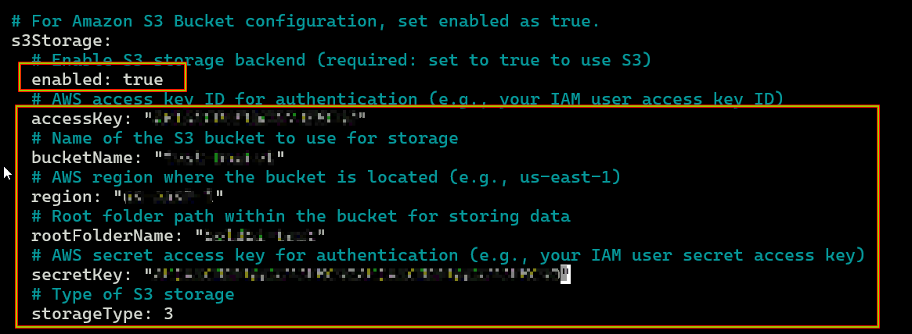
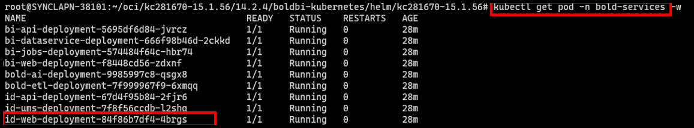
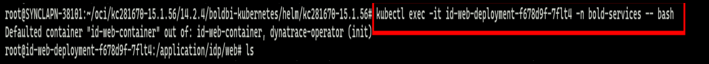
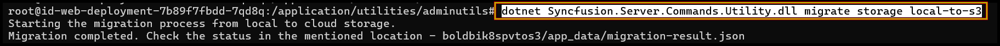
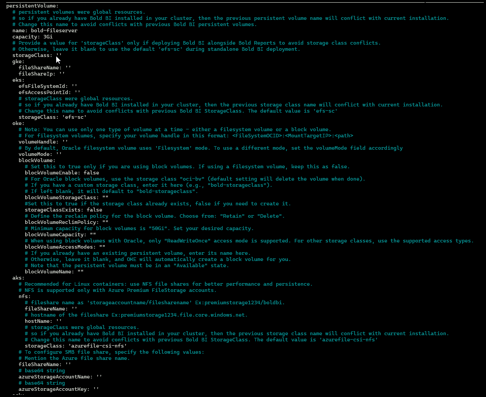
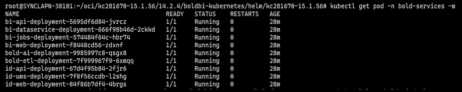

# Bold BI PV to AWS S3 Storage Migration on Kubernetes

This document describes the steps to migrate Bold BI application data from a Persistent Volume (PV) to **AWS S3 Storage** on a Kubernetes cluster.

---

## 1. Update the Bold BI Helm Repository
Use the following commands to update the Bold BI Helm repository:

```sh
helm repo update
```
**Troubleshooting: repo 404 when running `helm repo update`**

If you see an error like:

```
Hang tight while we grab the latest from your chart repositories...
...Unable to get an update from the "boldbi" chart repository (https://boldbi.github.io/boldbi-kubernetes):
        failed to fetch https://boldbi.github.io/boldbi-kubernetes/index.yaml : 404 Not Found
```

remove and re-add the repository (this fixes a stale/incorrect repo entry), then update:

```console
helm repo remove boldbi
helm repo add boldbi https://boldbi.github.io/boldbi-server-in-kubernetes
helm repo update
```

## 2. Update Image Repository and Tag
If using an existing `values.yaml` file, update the image repository and tag with the latest values provided.

- **Image Repo:** us-docker.pkg.dev/boldbi-294612/boldbi
- **Image Tag:** 16.1.70

## 3. Update Logging Configuration
Inside your `values.yaml`, update logging settings:

```yaml
logging:
  level: "both"   # info | error | both
  output: "console"  # console | file | both
```

## 4. Configure PV and AWS S3 Storage Details
Update your AWS s3 Storage configuration values in the `values.yaml` file.

```yaml
# For Amazon S3 Bucket configuration, set enabled as true.
s3Storage:
  # Enable S3 storage backend (required: set to true to use S3)
  enabled: false
  # AWS access key ID for authentication (e.g., your IAM user access key ID)
  accessKey: 
  # Name of the S3 bucket to use for storage
  bucketName: 
  # AWS region where the bucket is located (e.g., us-east-1)
  region: 
  # Root folder path within the bucket for storing data
  rootFolderName:
  # AWS secret access key for authentication (e.g., your IAM user secret access key)
  secretKey: 
  # Type of S3 storage
  storageType: 3
```



## 5. Upgrade the Bold BI Deployment
Run the following command to upgrade Bold BI using the updated `values.yaml` file:

```sh
helm upgrade boldbi boldbi/boldbi -f <my-values.yaml> -n bold-services
```
`Note:` After upgrading Bold BI with AWS S3 storage values using the Helm chart, the bi-web and bi-api services may temporarily become unavailable. This is expected behavior; you can proceed with the next step.

## 6. Access the idp-web Pod
Verify pods are running and open a shell into the **idp-web** pod:

```sh
kubectl get pods -n bold-services
kubectl exec -it <idp-web-pod-name> -n bold-services -- bash
```



## 7. Run the Migration Utility
Inside the pod, navigate and execute migration command:

```sh
cd /application/utilities/adminutils
dotnet Syncfusion.Server.Commands.Utility.dll migrate storage local-to-s3
```



Wait until the migration completes successfully.

## 8. Remove PV Configuration and Upgrade Again
After migration:

- Remove all PV-related config from `values.yaml`
  
  

- Upgrade again:

```sh
helm upgrade boldbi boldbi/kc281670 -f <my-values.yaml> -n bold-services
```

## 9. Verify the Application
Once all pods are running, open the Bold BI application using the configured base URL.



Migration is now complete, and Bold BI is fully running on **AWS S3 Object Storage**.

