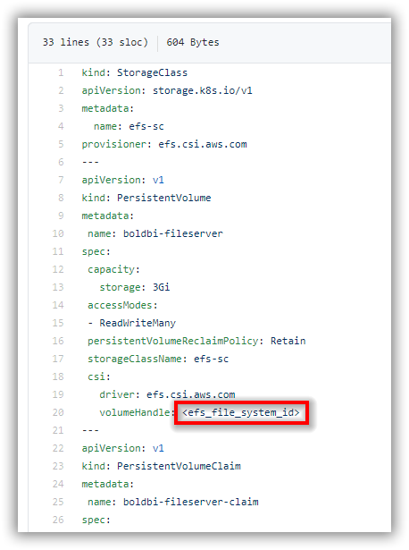

# Bold BI on Amazon Elastic Kubernetes Service
If you are upgrading Bold BI to 4.1.36, please follow the steps in this [link](upgrade.md).

For fresh installation, continue with the following steps to deploy Bold BI On-Premise in Amazon Elastic Kubernetes Service (Amazon EKS).

1. Download the following files for Bold BI deployment in Amazon EKS:

    * [namespace.yaml](https://raw.githubusercontent.com/boldbi/boldbi-kubernetes/v4.1.36/deploy/namespace.yaml)
	* [log4net_config.yaml](https://raw.githubusercontent.com/boldbi/boldbi-kubernetes/v4.1.36/deploy/log4net_config.yaml)
    * [pvclaim_eks.yaml](https://raw.githubusercontent.com/boldbi/boldbi-kubernetes/v4.1.36/deploy/pvclaim_eks.yaml)
    * [deployment.yaml](https://raw.githubusercontent.com/boldbi/boldbi-kubernetes/v4.1.36/deploy/deployment.yaml)
    * [hpa.yaml](https://raw.githubusercontent.com/boldbi/boldbi-kubernetes/v4.1.36/deploy/hpa.yaml)
    * [service.yaml](https://raw.githubusercontent.com/boldbi/boldbi-kubernetes/v4.1.36/deploy/service.yaml)
    * [ingress.yaml](https://raw.githubusercontent.com/boldbi/boldbi-kubernetes/v4.1.36/deploy/ingress.yaml)

2. Create an Amazon EKS cluster and [node group](https://docs.aws.amazon.com/eks/latest/userguide/eks-compute.html) to deploy Bold BI.

   https://docs.aws.amazon.com/eks/latest/userguide/getting-started.html 

3. Connect to your Amazon EKS cluster.

4. Deploy the EFS CSI Driver to your cluster and create an Amazon Elastic File System (EFS) volume to store the shared folders for applications’ usage by following the below link.

   https://docs.aws.amazon.com/eks/latest/userguide/efs-csi.html 

5. Note the **File system ID** after creating EFS file system.


6. Open **pvclaim_eks.yaml** file, downloaded in **Step 1**. Replace the **File system ID** noted in above step to the `<efs_file_system_id>` place in the file. You can also change the storage size in the YAML file. 



7. Deploy the latest Nginx ingress controller to your cluster using the following command.

```sh
kubectl apply -f https://raw.githubusercontent.com/kubernetes/ingress-nginx/controller-v0.41.2/deploy/static/provider/aws/deploy.yaml
```

8. Deploy the Kubernetes Metrics Server to use Horizontal Pod Autoscaler(HPA) feature by following the below link.

    https://docs.aws.amazon.com/eks/latest/userguide/metrics-server.html

9. Navigate to the folder where the deployment files were downloaded from **Step 1**.

10. Run the following command to create the namespace for deploying Bold BI.

```sh
kubectl apply -f namespace.yaml
```

11. Run the following command to create the configmap.

```sh
kubectl apply -f log4net_config.yaml
```

12. If you have a DNS to map with the application, you can continue with the following steps, else skip to **Step 16**. 

13. Open the **ingress.yaml** file. Uncomment the host value and replace your DNS hostname with `example.com` and save the file.

14. If you have the SSL certificate for your DNS and need to configure the site with your SSL certificate, follow the below step or you can skip to **Step 16**.

15. Run the following command to create a TLS secret with your SSL certificate.

```sh
kubectl create secret tls boldbi-tls -n boldbi --key <key-path> --cert <certificate-path>
```

16. Now, uncomment the `tls` section and replace your DNS hostname with `example.com` in ingress spec and save the file.


17. Run the following command for applying the Bold BI ingress to get the address of Nginx ingress,

```sh
kubectl apply -f ingress.yaml
```

18.	Now, run the following command to get the ingress address.

```sh
kubectl get ingress -n boldbi
```
Repeat the above command till you get the value in ADDRESS tab.
 

19.	Note the ingress address and map it with your DNS if you have added the DNS in **ingress.yaml** file. If you do not have the DNS and want to use the application, then you can use the ingress address.

20. Open the **deployment.yaml** file from the downloaded files in **Step 1**. Replace your DNS or ingress address in `<application_base_url>` place.
    
    Ex: `http://example.com`, `https://example.com`, `http://<ingress_address>`

21. Read the optional client library license agreement from the following link.

    [Consent to deploy client libraries](../docs/consent-to-deploy-client-libraries.md)

22. Note the optional client libraries from the above link as comma separated names and replace it in `<comma_separated_library_names>` place. Save the file after the required values has been replaced.

 

23. If you need to use **Bing Map** widget feature, enter value for `widget_bing_map_enable` environment variable as `true` and API key value for `widget_bing_map_api_key` on **deployment.yaml** file.

     

24.	Now, run the following commands one by one:

```sh
kubectl apply -f pvclaim_eks.yaml
```

```sh
kubectl apply -f deployment.yaml
```

```sh
kubectl apply -f hpa.yaml
```

```sh
kubectl apply -f service.yaml
```

25.	Wait for some time till the Bold BI On-Premise application deployed to your Amazon EKS cluster. 

26.	Use the following command to get the pods’ status.

```sh
kubectl get pods -n boldbi
```
 

27. Wait till you see the applications in running state. Then use your DNS or ingress address you got from **Step 17** to access the application in the browser.

28.	Configure the Bold BI On-Premise application startup to use the application. Please refer the following link for more details on configuring the application startup.
    
    https://help.boldbi.com/embedded-bi/application-startup
