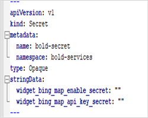
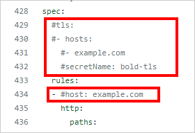
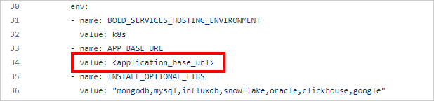
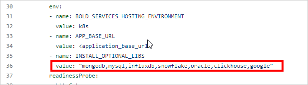
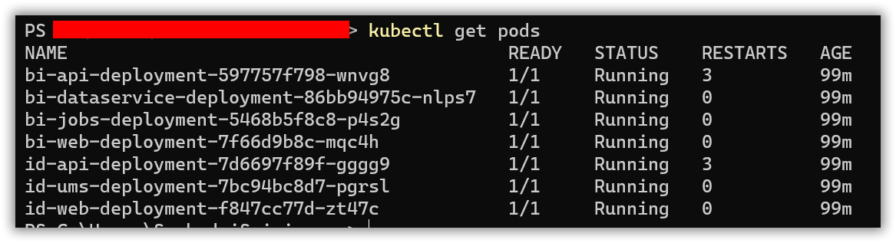

# Bold BI auto deployment using kubectl on Kubernetes Service

[Bold BI](https://www.boldbi.com/) can be deployed manually on Kubernetes cluster. You can create Kubernetes cluster on cloud cluster providers(GKE,AKS and EKS). After completing cluster creation, connect to it and you can download the configuration files [here](../deploy/auto-deployment.zip). This directory includes configuration YAML files, which contains all the configuration settings needed to deploy Bold BI on Kubernetes cluster.

### Deployment prerequisites

* [Install Kubectl](https://kubernetes.io/docs/tasks/tools/#kubectl) to deploy Bold BI using kubectl.
* [File Storage](pre-requisites.md#file-storage)
* [Create and connect a cluster](pre-requisites.md#create-a-cluster)
* Load Balancing- [Nginx](pre-requisites.md#ingress-nginx)


### Steps for Bold BI auto deployment.

1. Download the file for Bold BI deployment from [here](../deploy/auto-deployment.zip) and unzip the file then navigate to the unziped folder.

2. Navigate to the folder where the deployment files were downloaded from **Step 1**.

3. Configure the pvclaim.yaml file based on your cluster provider.
 
    * [Amazon Elastic Kubernetes Service (EKS)](persistent-volumes.md#azure-kubernetes-service)
    * [Azure Kubernetes Service (AKS)](persistent-volumes.mdpersistent-volumes.md#amazon-elastic-kubernetes-service)
    * [Google Kubernetes Engine (GKE)](persistent-volumes.mdpersistent-volumes.md#google-kubernetes-engine)

4. After connecting with your cluster, deploy the latest Nginx ingress controller to your cluster using the following command.

    ```sh
    kubectl apply -f https://raw.githubusercontent.com/kubernetes/ingress-nginx/controller-v1.2.0/deploy/static/provider/cloud/deploy.yaml
    ``` 

5. Enter the variable information needed to complete the auto deployment in <b>secrets-and-configmap.yaml</b> as shown below.

    * Enter the Bold BI licence key, username, and database server details.
        
        

        ## Environment variables details for configuring `Application Startup` in backend

        | Name                          |Required| Description   | 
        | -------------                 |----------| ------------- |
        |`BOLD_SERVICES_UNLOCK_KEY`|Yes|License key of Bold BI|
        |`BOLD_SERVICES_DB_TYPE`|Yes|Type of database server can be used for configuring the Bold BI.<br/><br />The following DB types are accepted:<br />1. mssql –           Microsoft SQL Server/Azure SQL Database<br />2. postgresql – PostgreSQL Server<br />3. mysql – MySQL/MariaDB Server|
        |`BOLD_SERVICES_DB_HOST`|Yes|Name of the Database Server|
        |`BOLD_SERVICES_DB_PORT`|No|The system will use the following default port numbers based on the database server type.<br />PostgrSQL – 5234<br />MySQL -3306<br         /><br />Please specify the port number for your database server if it is configured on a different port.<br /><br />For MS SQL Server, this parameter is not           necessary.|
        |`BOLD_SERVICES_DB_USER`|Yes|Username for the database server<br /><br />Please refer to [this documentation](https://help.boldbi.com/embedded-bi/faq/what-are-         the-database-permissions-required-to-set-up-bold-bi-embedded/) for information on the user's permissions.|
        |`BOLD_SERVICES_DB_PASSWORD`|Yes|The database user's password|
        |`BOLD_SERVICES_DB_NAME`|No|If the database name is not specified, the system will create a new database called bold services.<br /><br />If you specify a             database name, it should already exist on the server.|
        |`BOLD_SERVICES_POSTGRESQL_MAINTENANCE_DB`|No|For PostgreSQL DB Servers, this is an optional parameter.<br />The system will use the database name `postgres`           by default.<br />If your database server uses a different default database, please provide it here.|
        |`BOLD_SERVICES_DB_ADDITIONAL_PARAMETERS`|No|If your database server requires additional connection string parameters, include them here.<br /><br />Connection         string parameters can be found in the official document.<br />My SQL: https://dev.mysql.com/doc/connector-net/en/connector-net-8-0-connection-options.html<br           />PostgreSQL: https://www.npgsql.org/doc/connection-string-parameters.html<br />MS SQL: https://docs.microsoft.com/en-                       us/dotnet/api/system.data.sqlclient.sqlconnection.connectionstring<br /><br /><b>Note:</b> A semicolon(;) should be used to separate multiple parameters.|
        |`BOLD_SERVICES_USER_EMAIL`|Yes|It should be a valid email.|
        |`BOLD_SERVICES_USER_PASSWORD`|Yes|It should meet our password requirements.|
        
        
        
    *  If you want to use custom values for branding enter the branding image and site identifier variable details.otherwise Bold BI will take the default values.
        
       
  
        ## Environment variables for configuring `Branding` in backend

        The following environment variables are optional. If they are not provided, Bold BI will use the default configured values.

        <table>
           <tr>
              <td>
               <b>Name</b>
              </td>
              <td>
               <b>Description</b>
              </td>
            </tr>
            <tr>
              <td>
               BOLD_SERVICES_BRANDING_MAIN_LOGO
              </td>
              <td>   
               This is the header logo for the application, and the preferred image size is 40 x 40 pixels.
              </td>
            </tr>
            <tr>
              <td>
               BOLD_SERVICES_BRANDING_LOGIN_LOGO
              </td>
              <td>     
               This is the login logo for the application, and the preferred image size is 200 x 40 pixels.
              </td>
            </tr>
            <tr>
              <td>
               BOLD_SERVICES_BRANDING_EMAIL_LOGO
              </td>
              <td>     
               This is an email logo, and the preferred image size is 200 x 40 pixels.
              </td>
            </tr>
            <tr>
              <td>
               BOLD_SERVICES_BRANDING_FAVICON
              </td>
              <td>     
               This is a favicon, and the preferred image size is 40 x 40 pixels. 
              </td>
            </tr>
            <tr>
              <td>
               BOLD_SERVICES_BRANDING_FOOTER_LOGO
              </td>
              <td>     
               This is powered by the logo, and the preferred size is 100 x 25 pixels.
               <br />
               <br />
               <b>Note:</b><br/>• All branding variables are accepted as URL.<br/>• <b>Ex:</b> https://example.com/loginlogo.jpg.<br/>• <b>Image type:</b> png, svg, jpg,   jpeg.<br/>• If you want to use custom branding, provide the value for all branding variables. If all variable values are given, the application will use the branding images, otherwise, it will take the default logos. 
              </td>
            </tr>
            <tr>
              <td>
               BOLD_SERVICES_SITE_NAME
              </td>
              <td>
              This is organization name.     
              <br />
               If the value is not given, the site will be deployed using the default name.
              </td>
            </tr>
            <tr>
              <td>
               BOLD_SERVICES_SITE_IDENTIFIER
              </td>
              <td>     
               This is site identifier, and it will be the part of the application URL.
              <br />
              If the value is not given, the site will be deployed using the default value.
              </td>
            </tr>
        </table>
        <br/>
        
        
    * If you need to use **Bing Map** widget feature, enter value for `widget_bing_map_enable` environment variable as `true` and API key value for               `widget_bing_map_api_key`.
       
       

6. If you have a DNS to map with the application, then you can continue with the following steps, else skip to **Step 11**. 

7. Open the **ingress.yaml** file. Uncomment the host value and replace your DNS hostname with `example.com` and save the file.

8. If you have the SSL certificate for your DNS and need to configure the site with your SSL certificate, follow the below step or you can skip to **Step 11**.

9.  Run the following command to create a TLS secret with your SSL certificate.

```sh
kubectl create secret tls bold-tls -n bold-services --key <key-path> --cert <certificate-path>
```

10. Now, uncomment the `tls` section and replace your DNS hostname with `example.com` in ingress spec and save the file.



11. Run the following command for applying the Bold BI ingress to get the IP address of Nginx ingress.

```sh
kubectl apply -f ingress.yaml
```

12. Now, run the following command to get the ingress IP address.

```sh
kubectl get ingress -n bold-services
```

Repeat the above command till you get the IP address in ADDRESS tab as shown in the following image.
 

13. Note the ingress IP address and map it with your DNS, if you have added the DNS in **ingress.yaml** file. If you do not have the DNS and want to use the application, then you can use the ingress IP address.

14. Open the **deploy.yaml** file from the downloaded files in **Step 1**. Replace your DNS or ingress IP address in `<application_base_url>` place.

    Ex:  `http://example.com`, `https://example.com`, `http://<ingress_ip_address>`
    
     
    
15. Read the optional client library license agreement from the following link.

    [Consent to deploy client libraries](../docs/consent-to-deploy-client-libraries.md)
    
16. By default all the client libraries will be installed for Bold BI in Kubernetes. Still you can still overwrite them by mentioning the required libraries as comma seperated like below in the environment variable noted from the above link.

     

17. Now, run the following commands one by one:

```sh
kubectl apply -f secrets-and-configmap.yaml

kubectl apply -f deploy.yaml
```

26. Use the following command to get the pods status.

```sh
kubectl get pods -n bold-services
```
 

27. Wait till you see the applications in running state. Then use your DNS or ingress IP address you got from **Step 12** to access the application in the browser.
