# Bold BI Auto Deployment on Kubernetes Service

This section allows you to deploy [Bold BI](https://www.boldbi.com/) in Kubernetes without manual activation of licensing and configuring startup from the browser. This also allows us to customize the branding using environment variables.

# Deployment Methods

There are two ways to deploy Bold BI on the Kubernetes cluster. Please refer to the following documents for Bold BI deployment:

* [Deploy Bold BI using Kubectl](bold-bi-auto-deployment.md#deploy-bold-bi-using-kubectl)
* [Deploy Bold BI using Helm](bold-bi-auto-deployment.md#bold-bi-auto-deployment-using-helm)
   

# Deploy Bold BI using Kubectl

The following steps help you to deploy Bold BI using kubectl in a Kubernetes cluster. You can create a Kubernetes cluster on cloud cluster providers (GKE, AKS, and EKS). After completing cluster creation, connect to it, and you can download the configuration files [here](../deploy/auto-deployment.zip). This directory includes configuration YAML files, which contain all the configuration settings needed to deploy Bold BI on the Kubernetes cluster.

## Deployment prerequisites

The following requirements are necessary to deploy the Bold BI solution using kubectl:

* [Install Kubectl](https://kubernetes.io/docs/tasks/tools/#kubectl) to deploy Bold BI using kubectl.
* [File Storage](pre-requisites.md#file-storage)
* [Create and connect a cluster](pre-requisites.md#create-a-cluster)
* Load Balancing- [Nginx](https://kubernetes.github.io/ingress-nginx/deploy/)

## Steps for Bold BI auto deployment using kubectl.

The following links explain Bold BI Kubernetes deployment in specific cloud environments:

 * [Azure Kubernetes Service(AKS)](bold-bi-auto-deployment.md#bold-bi-on-microsoft-azure-kubernetes-service)
 * [Amazon Elastic Kubernetes Service(EKS)](bold-bi-auto-deployment.md#bold-bi-on-amazon-elastic-kubernetes-service)
 * [Google Kubernetes Engine (GKE)](bold-bi-auto-deployment.md#bold-bi-on-google-kubernetes-engine)


### Bold BI on Microsoft Azure Kubernetes Service

1. Download the deployment file from [here](https://raw.githubusercontent.com/boldbi/boldbi-kubernetes/main/deploy/auto-deployment/deploy_aks.yaml) to deploy Bold BI on AKS.

2. Navigate to the folder where the deployment files were downloaded in **Step 1**.

3. Create a `File share` instance in your storage account and note the `File share` name to store the shared folders for application use.

4. Encode the storage account name and storage key in base64 format.
  
   Run the following command in PowerShell to encode the values to base64.

    ```console
    [System.Convert]::ToBase64String([System.Text.Encoding]::UTF8.GetBytes("<plain-text>"))
    ```

   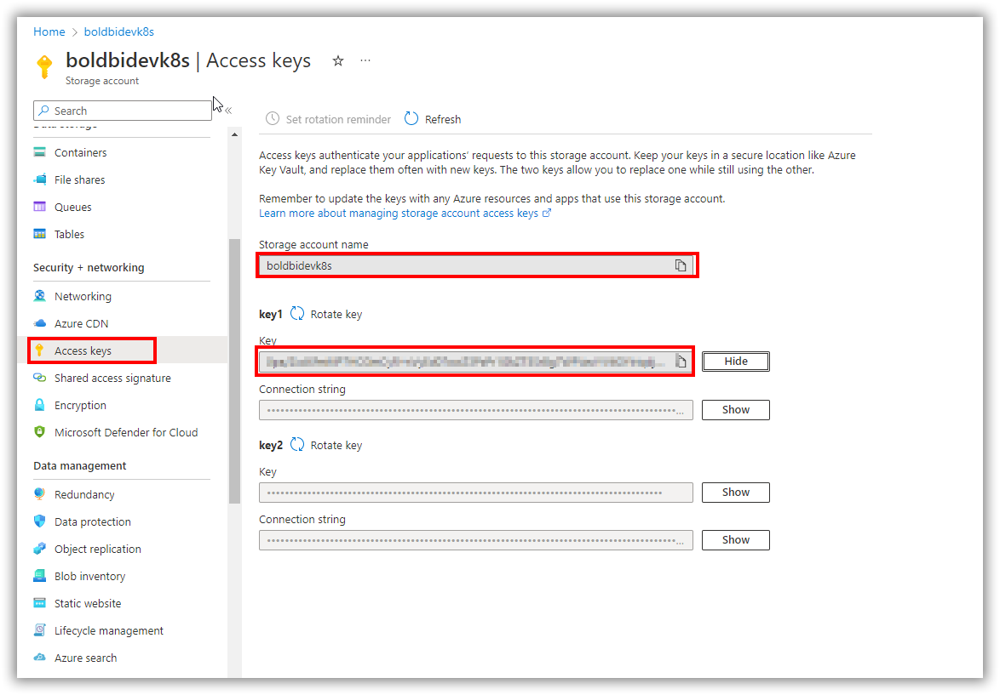

5. Open deploy_aks.yaml file downloaded in **Step 1**. Replace the **base64 encoded storage account name**, **base64 encoded storage account key**, and **File share name**, in the file with `<base64_azurestorageaccountname>`, `<base64_azurestorageaccountkey>`, and `<file_share_name>`, respectively. You can also change the storage size in the YAML file.

    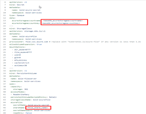

6. After connecting with your cluster, deploy the latest Nginx ingress controller to your cluster using the following command.

   ```sh
   kubectl apply -f https://raw.githubusercontent.com/kubernetes/ingress-nginx/controller-v1.2.0/deploy/static/provider/cloud/deploy.yaml
   ```

7. Enter the variable information needed to complete the auto-deployment in `deploy_aks.yaml` file, as shown in the following image.

    * Enter the Bold BI license key, user, and database server details.
        
        

        ## Environment variables details for configuring `Application Startup` in the backend.

        | Name                          |Required| Description   | 
        | -------------                 |----------| ------------- |
        |`BOLD_SERVICES_UNLOCK_KEY`|Yes|License key of Bold BI|
        |`BOLD_SERVICES_DB_TYPE`|Yes|Type of database server can be used for configuring the Bold BI.<br/><br />The following DB types are accepted:<br />1. mssql –           Microsoft SQL Server/Azure SQL Database<br />2. postgresql – PostgreSQL Server<br />3. mysql – MySQL/MariaDB Server|
        |`BOLD_SERVICES_DB_HOST`|Yes|Name of the Database Server|
        |`BOLD_SERVICES_DB_PORT`|No|The system will use the following default port numbers based on the database server type.<br />PostgrSQL – 5234<br />MySQL -3306<br         /><br />Please specify the port number for your database server if it is configured on a different port.<br /><br />For MS SQL Server, this parameter is not           necessary.|
        |`BOLD_SERVICES_DB_USER`|Yes|Username for the database server<br /><br />Please refer to [this documentation](https://help.boldbi.com/embedded-bi/faq/what-are-         the-database-permissions-required-to-set-up-bold-bi-embedded/) for information on the user's permissions.|
        |`BOLD_SERVICES_DB_PASSWORD`|Yes|The database user's password|
        |`BOLD_SERVICES_DB_NAME`|No|If the database name is not specified, the system will create a new database called bold services.<br /><br />If you specify a             database name, it should already exist on the server.|
        |`BOLD_SERVICES_POSTGRESQL_MAINTENANCE_DB`|No|For PostgreSQL DB Servers, this is an optional parameter.<br />The system will use the database name `postgres`           by default.<br />If your database server uses a different default database, please provide it here.|
        |`BOLD_SERVICES_DB_ADDITIONAL_PARAMETERS`|No|If your database server requires additional connection string parameters, include them here.<br /><br />Connection         string parameters can be found in the official document.<br />My SQL: https://dev.mysql.com/doc/connector-net/en/connector-net-8-0-connection-options.html<br           />PostgreSQL: https://www.npgsql.org/doc/connection-string-parameters.html<br />MS SQL: https://docs.microsoft.com/en-                       us/dotnet/api/system.data.sqlclient.sqlconnection.connectionstring<br /><br /><b>Note:</b> A semicolon(;) should be used to separate multiple parameters.|
        |`BOLD_SERVICES_USER_EMAIL`|Yes|It should be a valid email.|
        |`BOLD_SERVICES_USER_PASSWORD`|Yes|It should meet our password requirements.|

        <details>
          <summary>
            Example for above environment variables: 
          </summary>

          apiVersion: v1
          kind: Secret
          metadata:  
            name: bold-license-key
            namespace: bold-services
          type: Opaque
          stringData:
            BOLD_SERVICES_UNLOCK_KEY: "@332e332e30fgfTa4NmxTdRataMFgre/GC5AyCj+BHVoCO4ax6M61s=eyJFbWFpbCI6InN1YmJpcmFtYW5peWFuLnRAc3luY2Z1c2lvbi5jb20iLCJQcm9kdWN0cyI6"
          ---
          apiVersion: v1
          kind: Secret
          metadata:  
            name: bold-user-secret
            namespace: bold-services
          type: Opaque
          stringData:
            # It should be a valid email.
            BOLD_SERVICES_USER_EMAIL: "admin@boldbi.com"

            # It should meet our password requirements.
            BOLD_SERVICES_USER_PASSWORD: "Admin@123"
          ---
          apiVersion: v1
          kind: Secret
          metadata:  
            name: bold-db-secret
            namespace: bold-services
          type: Opaque
          stringData:
            # Type of database server can be used for configuring the Bold BI. Eg: mssql, mysql and postgresql
            BOLD_SERVICES_DB_TYPE: "postgresql"

            # Name of the Database Server
            BOLD_SERVICES_DB_HOST: "localhost"

            # The system will use the following default port numbers based on the database server type.
            # PostgrSQL – 5432 and MySQL -3306
            # Please specify the port number for your database server if it is configured on a different port.
            # For MS SQL Server, this parameter is not necessary.
            BOLD_SERVICES_DB_PORT: "5432"

            # Username for the database server
            # Please refer to this documentation for information on the user's permissions.
            # https://help.boldbi.com/embedded-bi/faq/what-are-the-database-permissions-required-to-set-up-bold-bi-embedded/
            BOLD_SERVICES_DB_USER: "boldbi@boldbi-docker"

            # The database user's password
            BOLD_SERVICES_DB_PASSWORD: "F8o:z$jasoKkel"

            # If the database name is not specified, the system will create a new database called bold services.
            # If you specify a database name, it should already exist on the server.
            BOLD_SERVICES_DB_NAME: ""

            # For PostgreSQL DB Servers, this is an optional parameter.
            # The system will use the database name postgres by default.
            # If your database server uses a different default database, please provide it here.
            BOLD_SERVICES_POSTGRESQL_MAINTENANCE_DB: "postgres"

            # If your database server requires additional connection string parameters, include them here
            # Connection string parameters can be found in the official document.
            # My SQL: https://dev.mysql.com/doc/connector-net/en/connector-net-8-0-connection-options.html
            # PostgreSQL: https://www.npgsql.org/doc/connection-string-parameters.html
            # MS SQL: https://docs.microsoft.com/en-us/dotnet/api/system.data.sqlclient.sqlconnection.connectionstring
            # Note: A semicolon(;) should be used to separate multiple parameters.
            BOLD_SERVICES_DB_ADDITIONAL_PARAMETERS: ""
          ---
        </details>

    *  If you want to use custom values for branding, enter the branding image and site identifier variable details. Otherwise Bold BI will take the default values.
        
       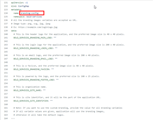
  
        ## Environment variables for configuring `Branding` in backend

        The following environment variables are optional. If they are not provided, Bold BI will use the default configured values.

        <table>
           <tr>
              <td>
               <b>Name</b>
              </td>
              <td>
               <b>Description</b>
              </td>
            </tr>
            <tr>
              <td>
               BOLD_SERVICES_BRANDING_MAIN_LOGO
              </td>
              <td>   
               This is the header logo for the application, and the preferred image size is 40 x 40 pixels.
              </td>
            </tr>
            <tr>
              <td>
               BOLD_SERVICES_BRANDING_LOGIN_LOGO
              </td>
              <td>     
               This is the login logo for the application, and the preferred image size is 200 x 40 pixels.
              </td>
            </tr>
            <tr>
              <td>
               BOLD_SERVICES_BRANDING_EMAIL_LOGO
              </td>
              <td>     
               This is an email logo, and the preferred image size is 200 x 40 pixels.
              </td>
            </tr>
            <tr>
              <td>
               BOLD_SERVICES_BRANDING_FAVICON
              </td>
              <td>     
               This is a favicon, and the preferred image size is 40 x 40 pixels. 
              </td>
            </tr>
            <tr>
              <td>
               BOLD_SERVICES_BRANDING_FOOTER_LOGO
              </td>
              <td>     
               This is powered by the logo, and the preferred size is 100 x 25 pixels.
               <br />
               <br />
               <b>Note:</b><br/>• All branding variables are accepted as URL.<br/>• <b>Ex:</b> https://example.com/loginlogo.jpg.<br/>• <b>Image type:</b> png, svg, jpg,   jpeg.<br/>• If you want to use custom branding, provide the value for all branding variables. If all variable values are given, the application will use the branding images, otherwise, it will take the default logos. 
              </td>
            </tr>
            <tr>
              <td>
               BOLD_SERVICES_SITE_NAME
              </td>
              <td>
              This is organization name.     
              <br />
               If the value is not given, the site will be deployed using the default name.
              </td>
            </tr>
            <tr>
              <td>
               BOLD_SERVICES_SITE_IDENTIFIER
              </td>
              <td>     
               This is site identifier, and it will be the part of the application URL.
              <br />
              If the value is not given, the site will be deployed using the default value.
              </td>
            </tr>
        </table>
        <br/>
        <details>
          <summary>
            <span style="color:blue"> Example for above environment variables:</span>  
          </summary>

            apiVersion: v1
            kind: ConfigMap
            metadata:
              name: branding-config
              namespace: bold-services
            # All the branding images variables are accepted as URL.
            # Image type: png, svg, jpg, jpeg
            # Ex: https://example.com/loginlogo.jpg
            data:
              # This is the header logo for the application, and the preferred image size is 40 x 40 pixels.
              <span style="color:yellow">BOLD_SERVICES_BRANDING_MAIN_LOGO: "https://i.postimg.cc/FRyqDKPT/branding-header-logo.png"</span>
              
              # This is the login logo for the application, and the preferred image size is 200 x 40 pixels.
              BOLD_SERVICES_BRANDING_LOGIN_LOGO: "https://i.postimg.cc/FRyqDKPT/branding-header-logo.png"
              
              # This is an email logo, and the preferred image size is 200 x 40 pixels.
              BOLD_SERVICES_BRANDING_EMAIL_LOGO: "https://i.postimg.cc/FRyqDKPT/branding-header-logo.png"
              
              # This is a favicon, and the preferred image size is 40 x 40 pixels.
              BOLD_SERVICES_BRANDING_FAVICON: "https://i.postimg.cc/FRyqDKPT/branding-header-logo.png "
              
              # This is powered by the logo, and the preferred size is 100 x 25 pixels.
              BOLD_SERVICES_BRANDING_FOOTER_LOGO: "https://i.postimg.cc/FRyqDKPT/branding-header-logo.png "
              
              # This is organization name.
              BOLD_SERVICES_SITE_NAME: "Autodeployment"
              
              # This is site identifier, and it will be the part of the application URL.
              BOLD_SERVICES_SITE_IDENTIFIER: "branding"

              # Note: If you want to use the custom branding, provide the value for all branding variables 
              # If all variable values are given, application will use the branding images,
              # otherwise it will take the default logos.
            ---     
        </details>

           
    * If you need to use the **Bing Map** widget feature, enter the value for `widget_bing_map_enable` environment variable as `true` and the API key value for `widget_bing_map_api_key`.
       
       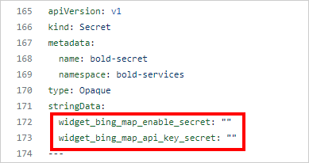

8. If you have a DNS to map with the application, proceed to the next steps, otherwise, skip to **Step 13**. 

9. Uncomment the host value and replace your DNS hostname with `example.com` in deploy_aks.yaml file in line **1442**.

      

10. If you have the SSL certificate for your DNS and need to configure the site with it, follow these steps, otherwise, skip to **Step 13**.

11.  Run the following command to create a TLS secret with your SSL certificate.

```sh
kubectl create secret tls bold-tls -n bold-services --key <key-path> --cert <certificate-path>
```

12. Now, uncomment the `tls` section and replace your DNS hostname with `example.com` in ingress spec and save the file.

       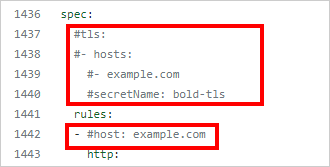

13. Now, run the following command to get the External IP address.

      ```sh
      kubectl get svc -n ingress-nginx
      ```
      Repeat the above command till you get the IP address in EXTERNAL-IP tab as shown in the following image. 
      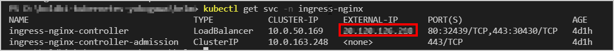 

14. Note the EXTERNAL-IP address and map it to your DNS if you have added it in the **deploy_aks.yaml** file. If you do not have a DNS, use the EXTERNAL-IP address to access the application.

15. Replace your DNS or EXTERNAL-IP address in `<application_base_url>` place.

    Ex:  `http://example.com`, `https://example.com`, `http://<external_ip_address>`
    
    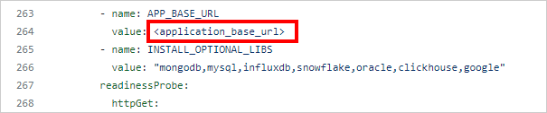 
    
16. Read the optional client library license agreement from the following link.

    [Consent to deploy client libraries](../docs/consent-to-deploy-client-libraries.md)
    
17. By default, all client libraries for Bold BI will be installed in Kubernetes. However, you can overwrite them by specifying the required libraries as a comma-separated list in the environment variable noted from the above link.

    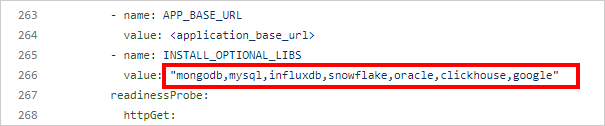 

18. Now, run the following commands to deploy Bold BI in your kubernetes cluster.

    ```sh
    kubectl apply -f deploy.yaml
    ```

19. Use the following command to get the pods status.

     ```sh
    kubectl get pods -n bold-services
     ```
    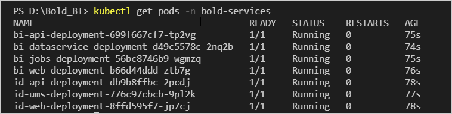 

20. Wait till you see the applications in running state. Then, use your DNS or EXTERNAL-IP address you got from the following command to access the application in the browser.
    
     ```sh
    kubectl get ingress -n bold-services
    ```
    

    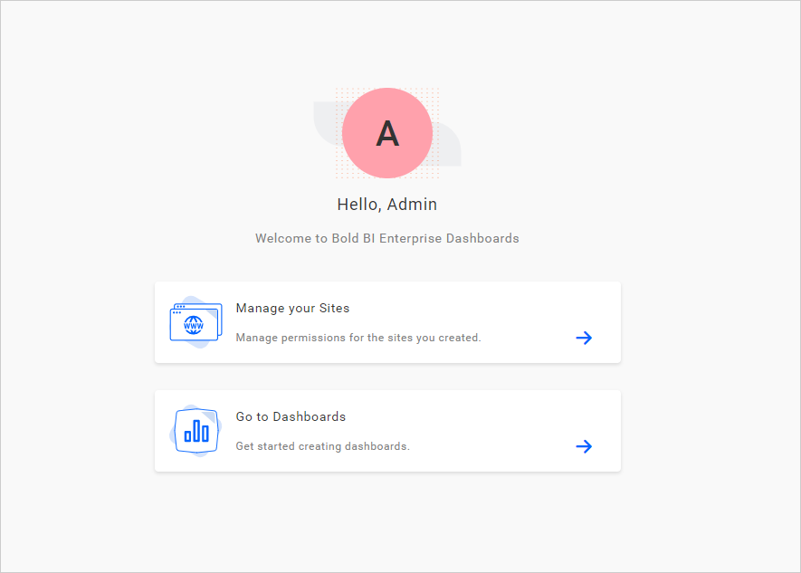 
    
21. If you encounter a Deployment Error, Click Proceed to the application startup page link, and Please refer to the following link for more details on configuring the application startup manually.
    
    https://help.boldbi.com/embedded-bi/application-startup
    
    
### Bold BI on Amazon Elastic Kubernetes Service

1. Download the deployment file [here](https://raw.githubusercontent.com/boldbi/boldbi-kubernetes/main/deploy/auto-deployment/deploy_eks.yaml) to deloy Bold BI on AKS.

2. Navigate to the folder where the deployment files were downloaded in **Step 1**.

3. Deploy the EFS CSI Driver to your cluster and create an Amazon Elastic File System (EFS) volume to store the shared folders for application usage by following the below link.
  
   https://docs.aws.amazon.com/eks/latest/userguide/efs-csi.html 

4. Note the **File system ID** after creating EFS file system.

    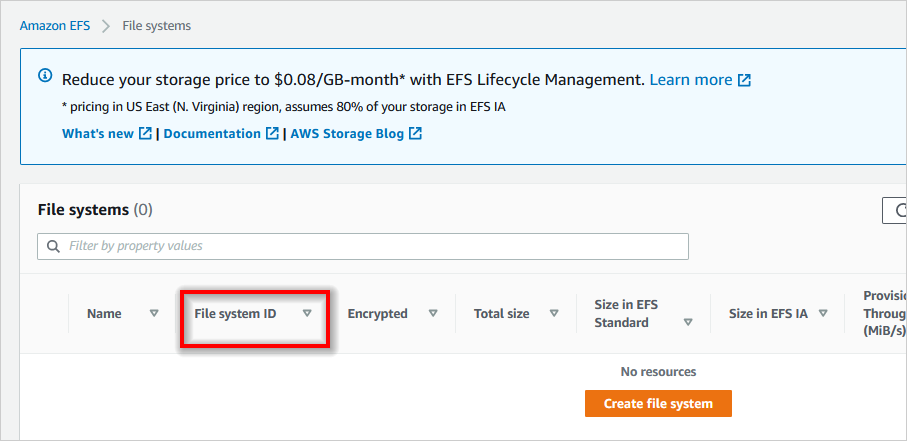

5. Open **deploy_eks.yaml** file, downloaded in **Step 1**. Replace the **File system ID** noted in above step to the `<efs_file_system_id>` place in the file. You can also change the storage size in the YAML file. 

   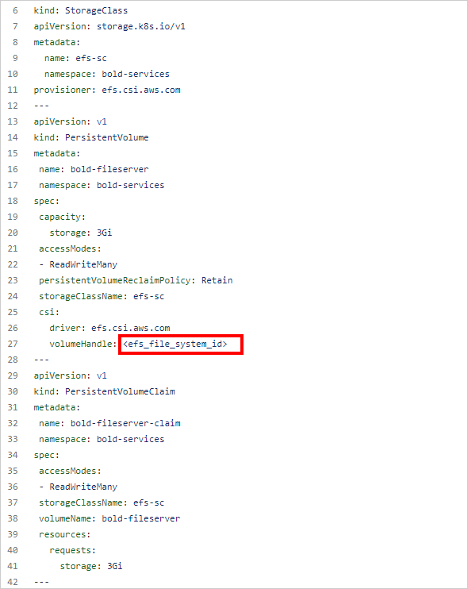

6. After connecting with your cluster, deploy the latest Nginx ingress controller to your cluster using the following command.

    ```sh  
    kubectl apply -f https://raw.githubusercontent.com/kubernetes/ingress-nginx/controller-v1.2.0/deploy/static/provider/aws/deploy.yaml
    ```
7. Enter the variable information needed to complete the auto-deployment in the **deploy_eks.yaml** file as shown in the following image.

    * Enter the Bold BI license key, user, and database server details.
        
        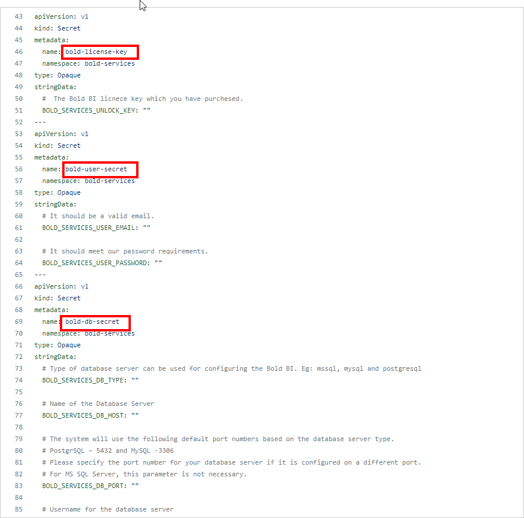

        ## Environment variables details for configuring `Application Startup` in the backend.

        | Name                          |Required| Description   | 
        | -------------                 |----------| ------------- |
        |`BOLD_SERVICES_UNLOCK_KEY`|Yes|License key of Bold BI|
        |`BOLD_SERVICES_DB_TYPE`|Yes|Type of database server can be used for configuring the Bold BI.<br/><br />The following DB types are accepted:<br />1. mssql –           Microsoft SQL Server/Azure SQL Database<br />2. postgresql – PostgreSQL Server<br />3. mysql – MySQL/MariaDB Server|
        |`BOLD_SERVICES_DB_HOST`|Yes|Name of the Database Server|
        |`BOLD_SERVICES_DB_PORT`|No|The system will use the following default port numbers based on the database server type.<br />PostgrSQL – 5234<br />MySQL -3306<br         /><br />Please specify the port number for your database server if it is configured on a different port.<br /><br />For MS SQL Server, this parameter is not           necessary.|
        |`BOLD_SERVICES_DB_USER`|Yes|Username for the database server<br /><br />Please refer to [this documentation](https://help.boldbi.com/embedded-bi/faq/what-are-         the-database-permissions-required-to-set-up-bold-bi-embedded/) for information on the user's permissions.|
        |`BOLD_SERVICES_DB_PASSWORD`|Yes|The database user's password|
        |`BOLD_SERVICES_DB_NAME`|No|If the database name is not specified, the system will create a new database called bold services.<br /><br />If you specify a             database name, it should already exist on the server.|
        |`BOLD_SERVICES_POSTGRESQL_MAINTENANCE_DB`|No|For PostgreSQL DB Servers, this is an optional parameter.<br />The system will use the database name `postgres`           by default.<br />If your database server uses a different default database, please provide it here.|
        |`BOLD_SERVICES_DB_ADDITIONAL_PARAMETERS`|No|If your database server requires additional connection string parameters, include them here.<br /><br />Connection         string parameters can be found in the official document.<br />My SQL: https://dev.mysql.com/doc/connector-net/en/connector-net-8-0-connection-options.html<br           />PostgreSQL: https://www.npgsql.org/doc/connection-string-parameters.html<br />MS SQL: https://docs.microsoft.com/en-                       us/dotnet/api/system.data.sqlclient.sqlconnection.connectionstring<br /><br /><b>Note:</b> A semicolon(;) should be used to separate multiple parameters.|
        |`BOLD_SERVICES_USER_EMAIL`|Yes|It should be a valid email.|
        |`BOLD_SERVICES_USER_PASSWORD`|Yes|It should meet our password requirements.|

        <details>
          <summary>
            Example for above environment variables: 
          </summary>

          apiVersion: v1
          kind: Secret
          metadata:  
            name: bold-license-key
            namespace: bold-services
          type: Opaque
          stringData:
            BOLD_SERVICES_UNLOCK_KEY: "@332e332e30fgfTa4NmxTdRataMFgre/GC5AyCj+BHVoCO4ax6M61s=eyJFbWFpbCI6InN1YmJpcmFtYW5peWFuLnRAc3luY2Z1c2lvbi5jb20iLCJQcm9kdWN0cyI6"
          ---
          apiVersion: v1
          kind: Secret
          metadata:  
            name: bold-user-secret
            namespace: bold-services
          type: Opaque
          stringData:
            # It should be a valid email.
            BOLD_SERVICES_USER_EMAIL: "admin@boldbi.com"

            # It should meet our password requirements.
            BOLD_SERVICES_USER_PASSWORD: "Admin@123"
          ---
          apiVersion: v1
          kind: Secret
          metadata:  
            name: bold-db-secret
            namespace: bold-services
          type: Opaque
          stringData:
            # Type of database server can be used for configuring the Bold BI. Eg: mssql, mysql and postgresql
            BOLD_SERVICES_DB_TYPE: "postgresql"

            # Name of the Database Server
            BOLD_SERVICES_DB_HOST: "localhost"

            # The system will use the following default port numbers based on the database server type.
            # PostgrSQL – 5432 and MySQL -3306
            # Please specify the port number for your database server if it is configured on a different port.
            # For MS SQL Server, this parameter is not necessary.
            BOLD_SERVICES_DB_PORT: "5432"

            # Username for the database server
            # Please refer to this documentation for information on the user's permissions.
            # https://help.boldbi.com/embedded-bi/faq/what-are-the-database-permissions-required-to-set-up-bold-bi-embedded/
            BOLD_SERVICES_DB_USER: "boldbi@boldbi-docker"

            # The database user's password
            BOLD_SERVICES_DB_PASSWORD: "F8o:z$jasoKkel"

            # If the database name is not specified, the system will create a new database called bold services.
            # If you specify a database name, it should already exist on the server.
            BOLD_SERVICES_DB_NAME: ""

            # For PostgreSQL DB Servers, this is an optional parameter.
            # The system will use the database name postgres by default.
            # If your database server uses a different default database, please provide it here.
            BOLD_SERVICES_POSTGRESQL_MAINTENANCE_DB: "postgres"

            # If your database server requires additional connection string parameters, include them here
            # Connection string parameters can be found in the official document.
            # My SQL: https://dev.mysql.com/doc/connector-net/en/connector-net-8-0-connection-options.html
            # PostgreSQL: https://www.npgsql.org/doc/connection-string-parameters.html
            # MS SQL: https://docs.microsoft.com/en-us/dotnet/api/system.data.sqlclient.sqlconnection.connectionstring
            # Note: A semicolon(;) should be used to separate multiple parameters.
            BOLD_SERVICES_DB_ADDITIONAL_PARAMETERS: ""
          ---
        </details>

    *  If you want to use custom values for branding enter the branding image and site identifier variable details.otherwise Bold BI will take the default values.
        
       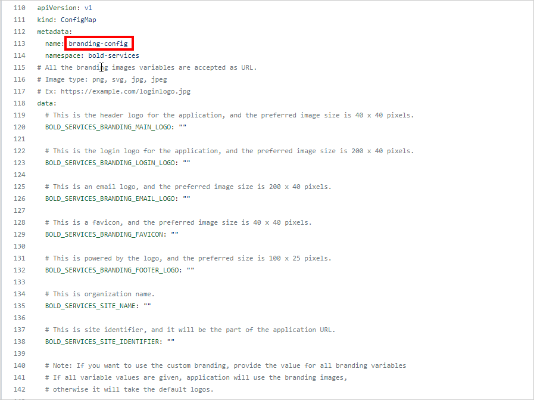
  
        ## Environment variables for configuring `Branding` in backend

        The following environment variables are optional. If they are not provided, Bold BI will use the default configured values.

        <table>
           <tr>
              <td>
               <b>Name</b>
              </td>
              <td>
               <b>Description</b>
              </td>
            </tr>
            <tr>
              <td>
               BOLD_SERVICES_BRANDING_MAIN_LOGO
              </td>
              <td>   
               This is the header logo for the application, and the preferred image size is 40 x 40 pixels.
              </td>
            </tr>
            <tr>
              <td>
               BOLD_SERVICES_BRANDING_LOGIN_LOGO
              </td>
              <td>     
               This is the login logo for the application, and the preferred image size is 200 x 40 pixels.
              </td>
            </tr>
            <tr>
              <td>
               BOLD_SERVICES_BRANDING_EMAIL_LOGO
              </td>
              <td>     
               This is an email logo, and the preferred image size is 200 x 40 pixels.
              </td>
            </tr>
            <tr>
              <td>
               BOLD_SERVICES_BRANDING_FAVICON
              </td>
              <td>     
               This is a favicon, and the preferred image size is 40 x 40 pixels. 
              </td>
            </tr>
            <tr>
              <td>
               BOLD_SERVICES_BRANDING_FOOTER_LOGO
              </td>
              <td>     
               This is powered by the logo, and the preferred size is 100 x 25 pixels.
               <br />
               <br />
               <b>Note:</b><br/>• All branding variables are accepted as URL.<br/>• <b>Ex:</b> https://example.com/loginlogo.jpg.<br/>• <b>Image type:</b> png, svg, jpg,   jpeg.<br/>• If you want to use custom branding, provide the value for all branding variables. If all variable values are given, the application will use the branding images, otherwise, it will take the default logos. 
              </td>
            </tr>
            <tr>
              <td>
               BOLD_SERVICES_SITE_NAME
              </td>
              <td>
              This is organization name.     
              <br />
               If the value is not given, the site will be deployed using the default name.
              </td>
            </tr>
            <tr>
              <td>
               BOLD_SERVICES_SITE_IDENTIFIER
              </td>
              <td>     
               This is site identifier, and it will be the part of the application URL.
              <br />
              If the value is not given, the site will be deployed using the default value.
              </td>
            </tr>
        </table>
        <br/>
        <details>
          <summary>
            <span style="color:blue"> Example for above environment variables:</span>  
          </summary>

            apiVersion: v1
            kind: ConfigMap
            metadata:
              name: branding-config
              namespace: bold-services
            # All the branding images variables are accepted as URL.
            # Image type: png, svg, jpg, jpeg
            # Ex: https://example.com/loginlogo.jpg
            data:
              # This is the header logo for the application, and the preferred image size is 40 x 40 pixels.
              <span style="color:yellow">BOLD_SERVICES_BRANDING_MAIN_LOGO: "https://i.postimg.cc/FRyqDKPT/branding-header-logo.png"</span>
              
              # This is the login logo for the application, and the preferred image size is 200 x 40 pixels.
              BOLD_SERVICES_BRANDING_LOGIN_LOGO: "https://i.postimg.cc/FRyqDKPT/branding-header-logo.png"
              
              # This is an email logo, and the preferred image size is 200 x 40 pixels.
              BOLD_SERVICES_BRANDING_EMAIL_LOGO: "https://i.postimg.cc/FRyqDKPT/branding-header-logo.png"
              
              # This is a favicon, and the preferred image size is 40 x 40 pixels.
              BOLD_SERVICES_BRANDING_FAVICON: "https://i.postimg.cc/FRyqDKPT/branding-header-logo.png "
              
              # This is powered by the logo, and the preferred size is 100 x 25 pixels.
              BOLD_SERVICES_BRANDING_FOOTER_LOGO: "https://i.postimg.cc/FRyqDKPT/branding-header-logo.png "
              
              # This is organization name.
              BOLD_SERVICES_SITE_NAME: "Autodeployment"
              
              # This is site identifier, and it will be the part of the application URL.
              BOLD_SERVICES_SITE_IDENTIFIER: "branding"

              # Note: If you want to use the custom branding, provide the value for all branding variables 
              # If all variable values are given, application will use the branding images,
              # otherwise it will take the default logos.
            ---     
        </details>

           
    * If you need to use the **Bing Map** widget feature, enter the value for `widget_bing_map_enable` environment variable as `true` and the API key value for `widget_bing_map_api_key`.
       
       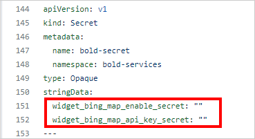

8. If you have a DNS to map with the application, proceed to the next steps, otherwise, skip to **Step 13**. 

9. Uncomment the host value and replace your DNS hostname with `example.com` in deploy_aks.yaml file in line **1421**.

      

10. If you have the SSL certificate for your DNS and need to configure the site with it, follow these steps, otherwise, skip to **Step 13**.

11.  Run the following command to create a TLS secret with your SSL certificate.

```sh
kubectl create secret tls bold-tls -n bold-services --key <key-path> --cert <certificate-path>
```

12. Now, uncomment the `tls` section and replace your DNS hostname with `example.com` in ingress spec and save the file.

       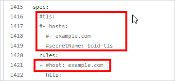

13. Now, run the following command to get the External IP address.

      ```sh
      kubectl get svc -n ingress-nginx
      ```
      Repeat the above command till you get the IP address in EXTERNAL-IP tab as shown in the following image. 
       

14. Note the EXTERNAL-IP address and map it to your DNS if you have added it in the **deploy_aks.yaml file**. If you do not have a DNS, use the EXTERNAL-IP address to access the application.

15. Replace your DNS or EXTERNAL-IP address in `<application_base_url>` place.

    Ex:  `http://example.com`, `https://example.com`, `http://<external_ip_address>`
    
    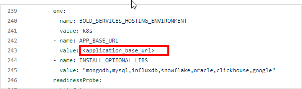 
    
16. Read the optional client library license agreement from the following link.

    [Consent to deploy client libraries](../docs/consent-to-deploy-client-libraries.md)
    
17. By default, all client libraries for Bold BI will be installed in Kubernetes. However, you can overwrite them by specifying the required libraries as a comma-separated list in the environment variable noted from the above link.

    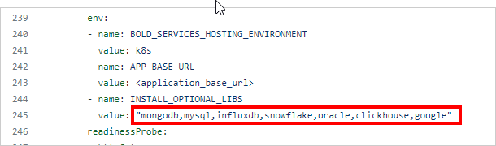 

18. Now, run the following commands to deploy Bold BI in your kubernetes cluster.

    ```sh
    kubectl apply -f deploy.yaml
    ```

19. Use the following command to get the pods status.

     ```sh
    kubectl get pods -n bold-services
     ```
     

20. Wait till you see the applications in running state. Then, use your DNS or EXTERNAL-IP address you got from the following command to access the application in the browser.
    
     ```sh
    kubectl get ingress -n bold-services
    ```
    

     
    
21. If you encounter a Deployment Error, Click Proceed to the application startup page link, and Please refer to the following link for more details on configuring the application startup manually.
    
    https://help.boldbi.com/embedded-bi/application-startup
    

### Bold BI on Google Kubernetes Engine   
    
1. Download the deployment file [here](https://raw.githubusercontent.com/boldbi/boldbi-kubernetes/main/deploy/auto-deployment/deploy_gke.yaml) to deloy Bold BI on AKS.

2. Navigate to the folder where the deployment files were downloaded in **Step 1**.

3. Create a Google filestore instance to store the shared folders for application usage.

   https://console.cloud.google.com/filestore 

4. Note the **File share name** and **IP address** after creating filestore instance.

   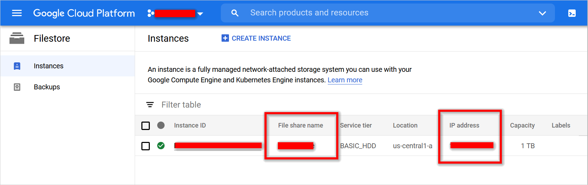

5. Open **deploy_gke.yaml** file, downloaded in **Step 1**. Replace the **File share name** and **IP address** noted in above step to the `<file_share_name>` and `<file_share_ip_address>` places in the file. You can also change the storage size in the YAML file. Save the file once you replaced the file share name and file share IP address.

   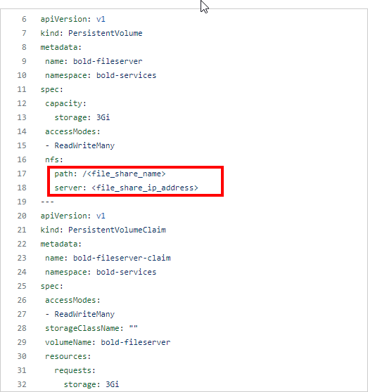

6. After connecting with your cluster, deploy the latest Nginx ingress controller to your cluster using the following command.

    ```sh
    kubectl apply -f https://raw.githubusercontent.com/kubernetes/ingress-nginx/controller-v1.2.0/deploy/static/provider/cloud/deploy.yaml
    ```
7. Enter the variable information needed to complete the auto-deployment in **deploy_gke.yaml** file, as shown in the following image.

    * Enter the Bold BI license key, user, and database server details.
        
        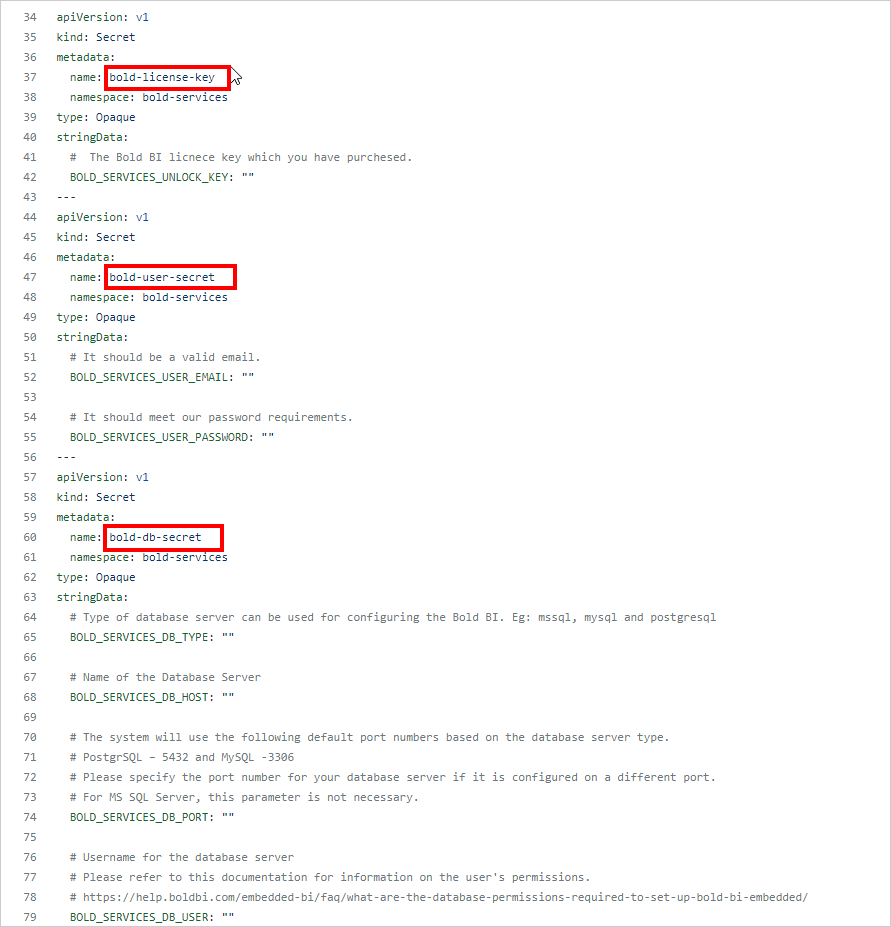

        ## Environment variables details for configuring `Application Startup` in the backend.

        | Name                          |Required| Description   | 
        | -------------                 |----------| ------------- |
        |`BOLD_SERVICES_UNLOCK_KEY`|Yes|License key of Bold BI|
        |`BOLD_SERVICES_DB_TYPE`|Yes|Type of database server can be used for configuring the Bold BI.<br/><br />The following DB types are accepted:<br />1. mssql –           Microsoft SQL Server/Azure SQL Database<br />2. postgresql – PostgreSQL Server<br />3. mysql – MySQL/MariaDB Server|
        |`BOLD_SERVICES_DB_HOST`|Yes|Name of the Database Server|
        |`BOLD_SERVICES_DB_PORT`|No|The system will use the following default port numbers based on the database server type.<br />PostgrSQL – 5234<br />MySQL -3306<br         /><br />Please specify the port number for your database server if it is configured on a different port.<br /><br />For MS SQL Server, this parameter is not           necessary.|
        |`BOLD_SERVICES_DB_USER`|Yes|Username for the database server<br /><br />Please refer to [this documentation](https://help.boldbi.com/embedded-bi/faq/what-are-         the-database-permissions-required-to-set-up-bold-bi-embedded/) for information on the user's permissions.|
        |`BOLD_SERVICES_DB_PASSWORD`|Yes|The database user's password|
        |`BOLD_SERVICES_DB_NAME`|No|If the database name is not specified, the system will create a new database called bold services.<br /><br />If you specify a             database name, it should already exist on the server.|
        |`BOLD_SERVICES_POSTGRESQL_MAINTENANCE_DB`|No|For PostgreSQL DB Servers, this is an optional parameter.<br />The system will use the database name `postgres`           by default.<br />If your database server uses a different default database, please provide it here.|
        |`BOLD_SERVICES_DB_ADDITIONAL_PARAMETERS`|No|If your database server requires additional connection string parameters, include them here.<br /><br />Connection         string parameters can be found in the official document.<br />My SQL: https://dev.mysql.com/doc/connector-net/en/connector-net-8-0-connection-options.html<br           />PostgreSQL: https://www.npgsql.org/doc/connection-string-parameters.html<br />MS SQL: https://docs.microsoft.com/en-                       us/dotnet/api/system.data.sqlclient.sqlconnection.connectionstring<br /><br /><b>Note:</b> A semicolon(;) should be used to separate multiple parameters.|
        |`BOLD_SERVICES_USER_EMAIL`|Yes|It should be a valid email.|
        |`BOLD_SERVICES_USER_PASSWORD`|Yes|It should meet our password requirements.|

        <details>
          <summary>
            Example for above environment variables: 
          </summary>

          apiVersion: v1
          kind: Secret
          metadata:  
            name: bold-license-key
            namespace: bold-services
          type: Opaque
          stringData:
            BOLD_SERVICES_UNLOCK_KEY: "@332e332e30fgfTa4NmxTdRataMFgre/GC5AyCj+BHVoCO4ax6M61s=eyJFbWFpbCI6InN1YmJpcmFtYW5peWFuLnRAc3luY2Z1c2lvbi5jb20iLCJQcm9kdWN0cyI6"
          ---
          apiVersion: v1
          kind: Secret
          metadata:  
            name: bold-user-secret
            namespace: bold-services
          type: Opaque
          stringData:
            # It should be a valid email.
            BOLD_SERVICES_USER_EMAIL: "admin@boldbi.com"

            # It should meet our password requirements.
            BOLD_SERVICES_USER_PASSWORD: "Admin@123"
          ---
          apiVersion: v1
          kind: Secret
          metadata:  
            name: bold-db-secret
            namespace: bold-services
          type: Opaque
          stringData:
            # Type of database server can be used for configuring the Bold BI. Eg: mssql, mysql and postgresql
            BOLD_SERVICES_DB_TYPE: "postgresql"

            # Name of the Database Server
            BOLD_SERVICES_DB_HOST: "localhost"

            # The system will use the following default port numbers based on the database server type.
            # PostgrSQL – 5432 and MySQL -3306
            # Please specify the port number for your database server if it is configured on a different port.
            # For MS SQL Server, this parameter is not necessary.
            BOLD_SERVICES_DB_PORT: "5432"

            # Username for the database server
            # Please refer to this documentation for information on the user's permissions.
            # https://help.boldbi.com/embedded-bi/faq/what-are-the-database-permissions-required-to-set-up-bold-bi-embedded/
            BOLD_SERVICES_DB_USER: "boldbi@boldbi-docker"

            # The database user's password
            BOLD_SERVICES_DB_PASSWORD: "F8o:z$jasoKkel"

            # If the database name is not specified, the system will create a new database called bold services.
            # If you specify a database name, it should already exist on the server.
            BOLD_SERVICES_DB_NAME: ""

            # For PostgreSQL DB Servers, this is an optional parameter.
            # The system will use the database name postgres by default.
            # If your database server uses a different default database, please provide it here.
            BOLD_SERVICES_POSTGRESQL_MAINTENANCE_DB: "postgres"

            # If your database server requires additional connection string parameters, include them here
            # Connection string parameters can be found in the official document.
            # My SQL: https://dev.mysql.com/doc/connector-net/en/connector-net-8-0-connection-options.html
            # PostgreSQL: https://www.npgsql.org/doc/connection-string-parameters.html
            # MS SQL: https://docs.microsoft.com/en-us/dotnet/api/system.data.sqlclient.sqlconnection.connectionstring
            # Note: A semicolon(;) should be used to separate multiple parameters.
            BOLD_SERVICES_DB_ADDITIONAL_PARAMETERS: ""
          ---
        </details>

    *  If you want to use custom values for branding enter the branding image and site identifier variable details.otherwise Bold BI will take the default values.
        
       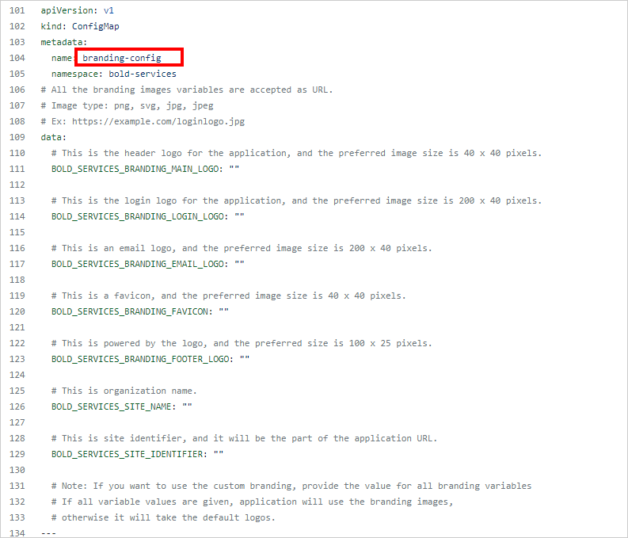
  
        ## Environment variables for configuring `Branding` in backend

        The following environment variables are optional. If they are not provided, Bold BI will use the default configured values.

        <table>
           <tr>
              <td>
               <b>Name</b>
              </td>
              <td>
               <b>Description</b>
              </td>
            </tr>
            <tr>
              <td>
               BOLD_SERVICES_BRANDING_MAIN_LOGO
              </td>
              <td>   
               This is the header logo for the application, and the preferred image size is 40 x 40 pixels.
              </td>
            </tr>
            <tr>
              <td>
               BOLD_SERVICES_BRANDING_LOGIN_LOGO
              </td>
              <td>     
               This is the login logo for the application, and the preferred image size is 200 x 40 pixels.
              </td>
            </tr>
            <tr>
              <td>
               BOLD_SERVICES_BRANDING_EMAIL_LOGO
              </td>
              <td>     
               This is an email logo, and the preferred image size is 200 x 40 pixels.
              </td>
            </tr>
            <tr>
              <td>
               BOLD_SERVICES_BRANDING_FAVICON
              </td>
              <td>     
               This is a favicon, and the preferred image size is 40 x 40 pixels. 
              </td>
            </tr>
            <tr>
              <td>
               BOLD_SERVICES_BRANDING_FOOTER_LOGO
              </td>
              <td>     
               This is powered by the logo, and the preferred size is 100 x 25 pixels.
               <br />
               <br />
               <b>Note:</b><br/>• All branding variables are accepted as URL.<br/>• <b>Ex:</b> https://example.com/loginlogo.jpg.<br/>• <b>Image type:</b> png, svg, jpg,   jpeg.<br/>• If you want to use custom branding, provide the value for all branding variables. If all variable values are given, the application will use the branding images, otherwise, it will take the default logos. 
              </td>
            </tr>
            <tr>
              <td>
               BOLD_SERVICES_SITE_NAME
              </td>
              <td>
              This is organization name.     
              <br />
               If the value is not given, the site will be deployed using the default name.
              </td>
            </tr>
            <tr>
              <td>
               BOLD_SERVICES_SITE_IDENTIFIER
              </td>
              <td>     
               This is site identifier, and it will be the part of the application URL.
              <br />
              If the value is not given, the site will be deployed using the default value.
              </td>
            </tr>
        </table>
        <br/>
        <details>
          <summary>
            <span style="color:blue"> Example for above environment variables:</span>  
          </summary>

            apiVersion: v1
            kind: ConfigMap
            metadata:
              name: branding-config
              namespace: bold-services
            # All the branding images variables are accepted as URL.
            # Image type: png, svg, jpg, jpeg
            # Ex: https://example.com/loginlogo.jpg
            data:
              # This is the header logo for the application, and the preferred image size is 40 x 40 pixels.
              <span style="color:yellow">BOLD_SERVICES_BRANDING_MAIN_LOGO: "https://i.postimg.cc/FRyqDKPT/branding-header-logo.png"</span>
              
              # This is the login logo for the application, and the preferred image size is 200 x 40 pixels.
              BOLD_SERVICES_BRANDING_LOGIN_LOGO: "https://i.postimg.cc/FRyqDKPT/branding-header-logo.png"
              
              # This is an email logo, and the preferred image size is 200 x 40 pixels.
              BOLD_SERVICES_BRANDING_EMAIL_LOGO: "https://i.postimg.cc/FRyqDKPT/branding-header-logo.png"
              
              # This is a favicon, and the preferred image size is 40 x 40 pixels.
              BOLD_SERVICES_BRANDING_FAVICON: "https://i.postimg.cc/FRyqDKPT/branding-header-logo.png "
              
              # This is powered by the logo, and the preferred size is 100 x 25 pixels.
              BOLD_SERVICES_BRANDING_FOOTER_LOGO: "https://i.postimg.cc/FRyqDKPT/branding-header-logo.png "
              
              # This is organization name.
              BOLD_SERVICES_SITE_NAME: "Autodeployment"
              
              # This is site identifier, and it will be the part of the application URL.
              BOLD_SERVICES_SITE_IDENTIFIER: "branding"

              # Note: If you want to use the custom branding, provide the value for all branding variables 
              # If all variable values are given, application will use the branding images,
              # otherwise it will take the default logos.
            ---     
        </details>

           
    * If you need to use the **Bing Map** widget feature, enter the value for `widget_bing_map_enable` environment variable as `true` and the API key value for `widget_bing_map_api_key`.
       
       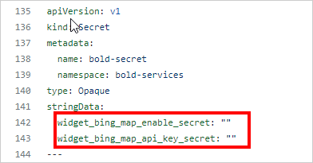

8. If you have a DNS to map with the application, proceed to the next steps, otherwise, skip to **Step 13**. 

9. Uncomment the host value and replace your DNS hostname with `example.com` in deploy_aks.yaml file in line **1412**.

      

10. If you have the SSL certificate for your DNS and need to configure the site with it, follow these steps, otherwise, skip to **Step 13**.

11.  Run the following command to create a TLS secret with your SSL certificate.

```sh
kubectl create secret tls bold-tls -n bold-services --key <key-path> --cert <certificate-path>
```

12. Now, uncomment the `tls` section and replace your DNS hostname with `example.com` in ingress spec and save the file.

       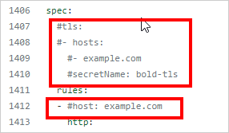

13. Now, run the following command to get the External IP address.

      ```sh
      kubectl get svc -n ingress-nginx
      ```
      Repeat the above command till you get the IP address in EXTERNAL-IP tab as shown in the following image. 
       

14. Note the EXTERNAL-IP address and map it to your DNS if you have added it in the **deploy_aks.yaml file**. If you do not have a DNS, use the EXTERNAL-IP address to access the application.

15. Replace your DNS or EXTERNAL-IP address in `<application_base_url>` place.

    Ex:  `http://example.com`, `https://example.com`, `http://<external>`
    
    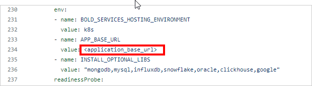 
    
16. Read the optional client library license agreement from the following link.

    [Consent to deploy client libraries](../docs/consent-to-deploy-client-libraries.md)
    
17. By default, all client libraries for Bold BI will be installed in Kubernetes. However, you can overwrite them by specifying the required libraries as a comma-separated list in the environment variable noted from the above link.

    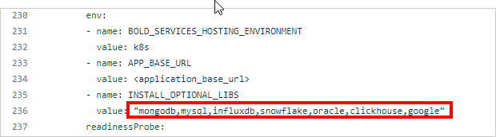 

18. Now, run the following commands to deploy Bold BI in your kubernetes cluster.

    ```sh
    kubectl apply -f deploy.yaml
    ```

19. Use the following command to get the pods status.

     ```sh
    kubectl get pods -n bold-services
     ```
     

20. Wait till you see the applications in running state. Then, use your DNS or EXTERNAL-IP address you got from the following command to access the application in the browser.
    
     ```sh
    kubectl get ingress -n bold-services
    ```
    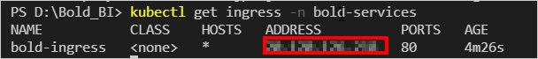

     
    
21. If you encounter a Deployment Error, Click Proceed to the application startup page link, and Please refer to the following link for more details on configuring the application startup manually.
    
    https://help.boldbi.com/embedded-bi/application-startup

# Bold BI Auto Deployment using Helm

This chart installs [Bold BI](https://www.boldbi.com/) on Kubernetes. You can create Kubernetes cluster in cloud cluster providers(GKE,AKS and EKS). Please follow the below documentation for Bold BI deployment in a specific cloud environments.

## Deployment prerequisites

* [Install Helm](https://helm.sh/docs/intro/install/) to deploy Bold BI using Helm.
* [File Storage](../docs/pre-requisites.md#file-storage)
* [Create and connect a cluster](../docs/pre-requisites.md#create-a-cluster)
* [Load Balancing](../docs/pre-requisites.md#load-balancing)

**Note:** Note the [Ingress IP address](docs/pre-requisites.md#get-ingress-ip) and map it with a DNS to craft values.yaml when installing Bold BI with helm chart.

## Get Repo Info

1. Add the Bold BI helm repository.

```console
helm repo add boldbi https://boldbi.github.io/boldbi-kubernetes
helm repo update
```

2. View charts in repo.

```console
helm search repo boldbi

NAME            CHART VERSION   APP VERSION     DESCRIPTION
boldbi/boldbi   6.17.13           6.17.13         Embed powerful analytics inside your apps and t...
```

_See [helm repo](https://helm.sh/docs/helm/helm_repo/) for command documentation._

## Create Namespace

Run the following command to create the namespace where the Bold BI resources will be deployed in the Kubernetes cluster. The default namespace is <i>bold-services</i>.

```console
kubectl create ns bold-services
```

## Install Chart

For the Helm chart, you need to craft a `values.yaml` file. So download the values.yaml file from [here](https://raw.githubusercontent.com/boldbi/boldbi-kubernetes/main/helm/custom-values/values.yaml) and make needed changes based on your cluster provider.

The following table allows you to craft the values.yaml file with required values for Bold BI deployment. so please read the description carefully and enter the values in values.yaml file.

<br/>

<table>
    <tr>
      <td>
       <b>Name</b>
      </td>
      <td>
       <b>Description</b>
      </td>
    </tr>
    <tr>
      <td>
       namespace
      </td>
      <td>
       The namespace in which the Bold BI resources will be dpleoyed in the kubernetes cluster.<br/>
       The default namespace is <i>bold-services</i>
      </td>
    </tr>
    <tr>
      <td>
       appBaseUrl *
      </td>
      <td>
       Domain with http/https protocol.
       <br/>
       Ex: `http://example.com`, `https://example.com`
       <br/>
       Follow the <a href='configuration.md#ssl-configuration'>SSL Configuration</a> to configure SSL certificate for https protocol.
      </td>
    </tr>
    <tr>
      <td>
       optionalLibs
      </td>
      <td>
       These are the client libraries used in Bold BI by default.<br/>
       '<i>mongodb,mysql,influxdb,snowflake,oracle,google,clickhouse</i>'<br/>
       Please refer to <a href='docs/configuration.md#client-libraries'>Optional Client Libraries</a> section to know more.
      </td>
    </tr>
    <tr>
      <td>
       clusterProvider
      </td>
      <td>
       The type of kubernetes cluster provider you are using.<br/>
       The supported values are '<i>gke,eks and aks</i>'
       Please refer to <a href='configuration.md#cluster-provider'>Cluster Provider</a> section to know more.
      </td>
    </tr>
    <tr>
      <td>
       persistentVolume*
      </td>
      <td>
       This is a file storage information to store the shared folders for application usage.
       Please refer to <a href='configuration.md#persistent-volume'>this</a> section to know more on how to set Persistant Volumes for Bold BI.
      </td>
    </tr>
    <tr>
      <td>
       loadBalancer
      </td>
      <td>
       Currently we have provided support for Nginx and Istio as Load Balancers in Bold BI. Please refer to <a href='docs/configuration.md#load-balancing'>this</a> section for configuring Load balancer for Bold BI.
      </td>
    </tr>
    <tr>
      <td>
       autoscaling
      </td>
      <td>
       By default autoscaling is enabled in Bold BI. Please refer to <a href='configuration.md#auto-scaling'>this</a> section to configure autoscaling in Bold BI.
      </td>
    </tr>
    <tr>
      <td>
       bingMapWidget
      </td>
      <td>
       Please refer to <a href='configuration.md#bing-map-widget'>this</a> section to configure Bing Map Widget in Bold BI.
      </td>
    </tr>
    <tr>
      <td>
       customLocalePath
      </td>
      <td>
       Custom locale file path for Localization.
       Please refer to <a href='configuration.md#custom-locale-path'>this</a> section to configure Custom Locale Path in Bold BI.
      </td>
    </tr>
    </table>
<br/>

> **Note:** Items marked with `*` are mandatory fields in values.yaml.

## Environment variables details for configuring `Application Startup` in the backend.

This following environment variables helps you to deploy Bold BI in Kubernetes without manually activating licensing and configuring startup from the browser.

<table>
    <tr>
      <td>
       <b>Name</b>
      </td>
      <td>
       <b>Description</b>
      </td>
    </tr>
    <tr>
      <td>
       licenseKey
      </td>
      <td>
       License key of Bold BI
      </td>
    </tr>
   <tr>
      <td>
       email *
      </td>
      <td>
       It should be a valid email.
      </td>
    </tr>
    <tr>
      <td>
       password *
      </td>
      <td>
       It should meet our password requirements. <br /> <br />Note: <br />Password must meet the following requirements. It must contain,At least 6 characters, 1 uppercase character, 1 lowercase character, 1 numeric character, 1 special character
      </td>
    </tr>
    <tr>
      <td>
       dbType *
      </td>
      <td>
       Type of database server can be used for configuring the Bold BI.<br/><br />The following DB types are accepted:<br />1. mssql – Microsoft SQL Server/Azure SQL Database<br />2. postgresql – PostgreSQL Server<br />3. mysql – MySQL/MariaDB Server
      </td>
    </tr>
    <tr>
      <td>
       dbHost *
      </td>
      <td>
       Name of the Database Server
      </td>
    </tr>
    <tr>
      <td>
       dbPort
      </td>
      <td>
       The system will use the following default port numbers based on the database server type.<br />PostgrSQL – 5234<br />MySQL -3306<br /><br />Please specify the port number for your database server if it is configured on a different port.<br /><br />For MS SQL Server, this parameter is not necessary.
      </td>
    </tr>
    <tr>
      <td>
       dbUser *
      </td>
      <td>
       Username for the database server<br /><br />Please refer to [this documentation](https://help.boldbi.com/embedded-bi/faq/what-are-the-database-permissions-required-to-set-up-bold-bi-embedded/) for information on the user's permissions.
      </td>
    </tr>
    <tr>
      <td>
       dbPassword *
      </td>
      <td>
       The database user's password
      </td>
    </tr>
    <tr>
      <td>
       dbName
      </td>
      <td>
       If the database name is not specified, the system will create a new database called bold services.<br /><br />If you specify a database name, it should already exist on the server.
      </td>
    </tr>
    <tr>
      <td>
       maintenanceDB
      </td>
      <td>
       For PostgreSQL DB Servers, this is an optional parameter.<br />The system will use the database name `postgres` by default.<br />If your database server uses a different default database, please provide it here.
      </td>
    </tr>
    <tr>
      <td>
       dbAdditionalParameters
      </td>
      <td>
       If your database server requires additional connection string parameters, include them here.<br /><br />Connection string parameters can be found in the official document.<br />My SQL: https://dev.mysql.com/doc/connector-net/en/connector-net-8-0-connection-options.html<br />PostgreSQL: https://www.npgsql.org/doc/connection-string-parameters.html<br />MS SQL: https://docs.microsoft.com/en-us/dotnet/api/system.data.sqlclient.sqlconnection.connectionstring<br /><br /><b>Note:</b> A semicolon(;) should be used to separate multiple parameters.
      </td>
    </tr>
</table>
<br/>

> **Note:** Items marked with `*` are mandatory fields in values.yaml

<details>
          <summary>
            <span style="color:blue"> Example for above environment variables:</span>  
          </summary>

            ## Secrets for Bold BI Auto Deployment.
            # This section helps you to deploy Bold BI in Kubernetes without manually activating licensing and configuring startup from the browser.  
  
            licenseKeyDetails:
              #  The Bold BI licnece key which you have purchesed.
              licenseKey: "@332e332e30fgfTa4NmxTdRataMFgre/GC5AyCj+BHVoCO4ax6M61s=eyJFbWFpbCI6"

            rootUserDetails:
              email: "admin@boldbi.com"
              password: "Admin@123"

            databaseServerDetails:
              # Type of database server can be used for configuring the Bold BI. Eg: mssql, mysql and postgresql
              dbType: "postgresql"

              # Name of the Database Server
              dbHost: "boldbi-docker.postgres.database.azure.com"

              # The system will use the following default port numbers based on the database server type.
              # PostgrSQL – 5432 and MySQL -3306
              # Please specify the port number for your database server if it is configured on a different port.
              # For MS SQL Server, this parameter is not necessary.
              dbPort: "5432"

              # Username for the database server
              # Please refer to this documentation for information on the user's permissions.
              # https://help.boldbi.com/embedded-bi/faq/what-are-the-database-permissions-required-to-set-up-bold-bi-embedded/
              dbUser: "boldbi@boldbi"

              # The database user's password
              dbPassword: "F8o:z$jasoKkel"

              # If the database name is not specified, the system will create a new database called bold services.
              # If you specify a database name, it should already exist on the server.
              dbName: ""

              # For PostgreSQL DB Servers, this is an optional parameter.
              # The system will use the database name postgresql by default.
              # If your database server uses a different default database, please provide it here.
              maintenanceDB: "postgres"

              # If your database server requires additional connection string parameters, include them here
              # Connection string parameters can be found in the official document.
              # My SQL: https://dev.mysql.com/doc/connector-net/en/connector-net-8-0-connection-options.html
              # PostgreSQL: https://www.npgsql.org/doc/connection-string-parameters.html
              # MS SQL: https://docs.microsoft.com/en-us/dotnet/api/system.data.sqlclient.sqlconnection.connectionstring
              # Note: A semicolon(;) should be used to separate multiple parameters.
              dbAdditionalParameters: ""

</details>

## Environment variables details for configuring `branding` in backend

The following environment variables allow you to customize the branding.

<table>
   <tr>
      <td>
       <b>Name</b>
      </td>
      <td>
       <b>Description</b>
      </td>
    </tr>
    <tr>
      <td>
       mainLogo *
      </td>
      <td>   
       This is header logo for the applicationand the preferred image size is 40 x 40 pixels.
      </td>
    </tr>
    <tr>
      <td>
       loginLogo *
      </td>
      <td>     
       This is login logo for the application and the preferred image size is 200 x 40 pixels.
      </td>
    </tr>
    <tr>
      <td>
       emailLogo *
      </td>
      <td>     
       This is email logo, and the preferred image size is 200 x 40 pixels.
      </td>
    </tr>
    <tr>
      <td>
       favicon *
      </td>
      <td>     
       This is favicon and the preferred image size is 40 x 40 pixels. 
      </td>
    </tr>
    <tr>
      <td>
       footerLogo *
      </td>
      <td>     
       This is powered by logo and the preferred size is 100 x 25 pixels.
       <br />
       <br />
       <b>Note:</b><br/>• All the branding variables are accepted as URL.<br/>• <b>Ex:</b> https://example.com/loginlogo.jpg <br/>• <b>Image type:</b> png, svg, jpg, jpeg.<br/>• If you want to use the custom branding, provide the value for all branding variables If all variable values are given, application will use the branding images, otherwise it will take the default logos. 
      </td>
    </tr>
    <tr>
      <td>
       siteName
      </td>
      <td>
      This is organization name.     
      <br />
       If the value is not given, the site will be deployed using the default name.
      </td>
    </tr>
    <tr>
      <td>
       siteIdentifier
      </td>
      <td>     
       This is site identifier, and it will be the part of the application URL.
      <br />
      If the value is not given, the site will be deployed using the default value.
      </td>
    </tr>
</table>
<br/>

> **Note:** Items marked with `*` are mandatory fields in values.yaml

<details>
          <summary>
            <span style="color:blue"> Example for above environment variables:</span>  
          </summary>

            # Environment Variables For Application Branding.
            # This environment variables helps us to customize the branding.  

            brandingDetails:

              # This is the header logo for the application, and the preferred image size is 40 x 40 pixels.
              main_logo:  https://i.postimg.cc/6pJTRr8W/autumn-fall-nature-scene-autumnal-park-beautiful-77869343-1.jpg

              # This is the login logo for the application, and the preferred image size is 200 x 40 pixels.
              login_logo:  https://i.postimg.cc/6pJTRr8W/autumn-fall-nature-scene-autumnal-park-beautiful-77869343-1.jpg

              # This is an email logo, and the preferred image size is 200 x 40 pixels.
              email_logo:  https://i.postimg.cc/6pJTRr8W/autumn-fall-nature-scene-autumnal-park-beautiful-77869343-1.jpg

              # This is a favicon, and the preferred image size is 40 x 40 pixels.
              favicon:  https://i.postimg.cc/6pJTRr8W/autumn-fall-nature-scene-autumnal-park-beautiful-77869343-1.jpg

              # This is powered by the logo, and the preferred size is 100 x 25 pixels.  
              footer_logo:  https://i.postimg.cc/6pJTRr8W/autumn-fall-nature-scene-autumnal-park-beautiful-77869343-1.jpg

              # This is organization name. 
              site_name: Autodeployment

              # This is site identifier, and it will be the part of the application URL.
              site_identifier: Branding
</details>

Run the following command to delpoy Bold BI in your cluster.

```console
helm install [RELEASE_NAME] boldbi/boldbi -f [Crafted values.yaml file]
```
Ex:  `helm install boldbi boldbi/boldbi -f my-values.yaml`

_See [helm install](https://helm.sh/docs/helm/helm_install/) for command documentation._

## Upgrade

Run the following command to get the latest version of the Bold BI helm chart.

```console
helm repo update
```

Run the following command to apply changes in your Bold BI release or upgrade Bold BI to the latest version.

```console
helm upgrade [RELEASE_NAME] boldbi/boldbi -f [Crafted values.yaml file]
```

Ex:  `helm upgrade boldbi boldbi/boldbi -f my-values.yaml`

## Uninstall Chart

```console
helm uninstall [RELEASE_NAME]
```
Ex:  `helm uninstall boldbi`

This removes all the Kubernetes components associated with the chart and deletes the release.

_See [helm uninstall](https://helm.sh/docs/helm/helm_uninstall/) for command documentation._
