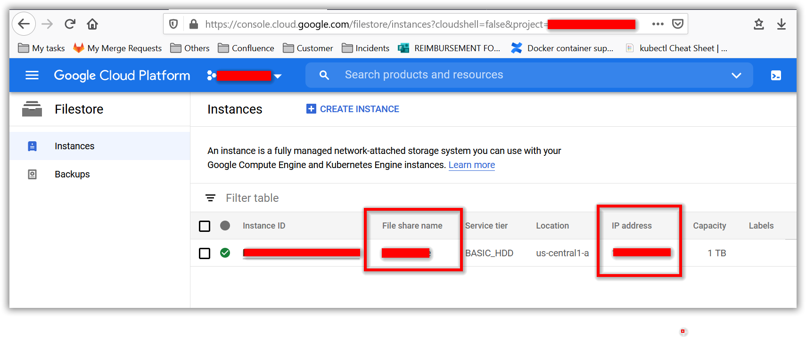

# Bold BI on GKE
Please follow the below steps to deploy Bold BI On-Premise in Google Kubernetes Engine (GKE).

1.	Download the files required for Bold BI deployment in GKE from following location,
[deploy](deploy/)

2. Create a Kubernetes cluster in Google Cloud Platform (GCP) to deploy the Bold BI On-Premise application.
https://console.cloud.google.com/kubernetes 

3.	Create a Google filestore instance to store the shared folders for applications’ usage.
https://console.cloud.google.com/filestore 

4.	Note the **File share name** and **IP address** after creating filestore instance,

5.	Open **pvclaim_gke.yaml** file, downloaded in **step 1**. Replace the **File share name** and **IP address** noted in above step to the `<file_share_name>` and `<file_share_ip_address>` places in the file. Save the file once you replaced the file share name and file share IP address.

6.	Set your project and newly created cluster in Google cloud shell,
https://cloud.google.com/kubernetes-engine/docs/quickstart 

7.	Deploy the Nginx ingress controller to your cluster using the following command,

`kubectl apply -f https://raw.githubusercontent.com/kubernetes/ingress-nginx/controller-v0.41.2/deploy/static/provider/cloud/deploy.yaml`

8.	Next, run the following command for applying the Bold BI ingress to get the IP address of nginx ingress,

`kubectl apply -f ingress.yaml`

9.	Now run the following command to get the ingress IP address,

`kubectl get ingress`

Repeat the above command till you get the IP address in ADDRESS tab like in below image.
 

10.	Note the ingress IP address and open the **deployment.yaml** file from the downloaded files on **step 1**.

11. Replace the above copied ingress IP address in `<ingress_ip_address>` place. Save the file once you replaced the ingress IP address.
 

12.	Now run the following commands one by one in Google cloud shell,

`kubectl apply -f pvclaim_gke.yaml`

`kubectl apply -f deployment.yaml`

`kubectl apply -f service.yaml`

`kubectl apply -f ingress.yaml`

13.	Now wait for some time to deploy the Bold BI On-Premise application in your Google Kubernetes cluster. 

14.	Use the following command to get the pods’ status,

`kubectl get pods`
 

15.	Wait till you see all applications were in running state. Some applications may go get error and go to CrashLoopBackoff state. But they will change to Running state after some time.

16.	Then use the ingress IP address, you got on **step 9** to access the application in browser. The Bold BI On-Premise application will run on the ingress IP address.

17.	Configure the Bold BI On-Premise application startup to use the application.