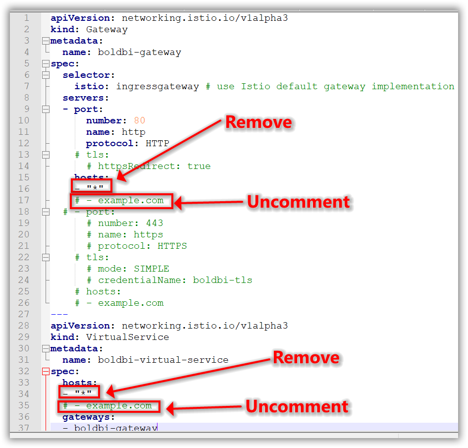
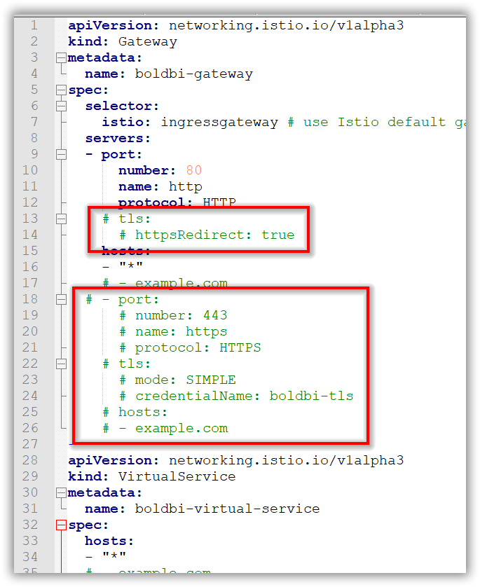

# Bold BI on Microsoft Azure Kubernetes Service with Istio Gateway
Please follow the below steps to deploy Bold BI On-Premise in Microsoft Azure Kubernetes Service (AKS) with Istio Gateway.

1. Download the following files for Bold BI deployment in AKS:

    * [pvclaim_aks.yaml](https://raw.githubusercontent.com/boldbi/boldbi-kubernetes/v4.1.36_istio_gateway/deploy/pvclaim_aks.yaml)
    * [deployment.yaml](https://raw.githubusercontent.com/boldbi/boldbi-kubernetes/v4.1.36_istio_gateway/deploy/deployment.yaml)
    * [hpa.yaml](https://raw.githubusercontent.com/boldbi/boldbi-kubernetes/v4.1.36_istio_gateway/deploy/hpa.yaml)
    * [service.yaml](https://raw.githubusercontent.com/boldbi/boldbi-kubernetes/v4.1.36_istio_gateway/deploy/service.yaml)
    * [istio_gateway.yaml](https://raw.githubusercontent.com/boldbi/boldbi-kubernetes/v4.1.36_istio_gateway/deploy/istio_gateway.yaml)
    * [destination_rule.yaml](https://raw.githubusercontent.com/boldbi/boldbi-kubernetes/v4.1.36_istio_gateway/deploy/destination_rule.yaml)

2. Create a Kubernetes cluster in Microsoft Azure Kubernetes Service (AKS) to deploy Bold BI.

3. Create a File share instance in your storage account and note the File share name to store the shared folders for applications’ usage.

4. Encode the storage account name and storage key in base64 format.

5. Open **pvclaim_aks.yaml** file, downloaded in **Step 1**. Replace the **base64 encoded storage account name**, **base64 encoded storage account key**, and **File share name** noted in above steps to `<base64_azurestorageaccountname>`, `<base64_azurestorageaccountkey>`, and `<file_share_name>` places in the file respectively. You can also change the storage size in the YAML file.

    

6. Connect with your Microsoft AKS cluster.

7.	Install istio ingress gateway in your AKS cluster by following the below link,

    https://docs.microsoft.com/en-us/azure/aks/servicemesh-istio-install

8.	Wait and get istio ingress gateway externa IP using the following command.

```sh
kubectl -n istio-system get service istio-ingressgateway -o jsonpath='{.status.loadBalancer.ingress[0].ip}'
```

9.	If you have a DNS to map with the application, then you can continue with the following steps, else skip to **Step 16**. If you do not have the DNS and want to use the application, then you can use the istio ingress gateway externa IP address which you got from above step.

10.	Map istio ingress gateway external ip to your DNS record.

11.	Open **istio_gateway.yaml** file downloaded from Step 1.

12.	Remove the line `*` from hosts, uncomment the next line and replace your DNS host name with **example.com** and save the file.

    

13.	If you have the SSL certificate for your DNS and need to configure the site with your SSL certificate, follow the below steps or you can skip to **Step 16**.

14.	Run the following command to create a TLS secret with your SSL certificate.

```sh
kubectl create -n istio-system secret tls boldbi-tls --key <key-path> --cert <certificate-path>
```

15.	Now, uncomment the following section in **istio_gateway.yaml** file and replace your DNS hostname with `example.com` and save the file.

    

16.	Open the deployment.yaml file from the downloaded files in Step 1. Replace your DNS or istio ingress gateway externa IP address in <application_base_url> place.

    Ex: 
        `http://example.com`
        `https://example.com`
        `http://<istio_ingress_gateway_externa_IP_address>`

17. Read the optional client library license agreement from the following link.

    [Consent to deploy client libraries](../docs/consent-to-deploy-client-libraries.md)

18. Note the optional client libraries from the above link as comma separated names and replace it in `<comma_separated_library_names>` place. Save the file after the required values has been replaced.

     

19. If you need to use **Bing Map** widget feature, enter value for `widget_bing_map_enable` environment variable as `true` and API key in `widget_bing_map_api_key` value on **deployment.yaml** file.

     

20. Now, run the following commands one by one:

```sh
kubectl apply -f pvclaim_aks.yaml
```

```sh
kubectl apply -f deployment.yaml
```

```sh
kubectl apply -f hpa.yaml
```

```sh
kubectl apply -f service.yaml
```

```sh
kubectl apply -f istio_gateway.yaml
```

```sh
kubectl apply -f destination_rule.yaml
```

21. If you face any error while applying the **hpa.yaml**, try to use **hpa_gke.yaml**. The **hpa_gke.yaml** does not contain scaledown behavior which will not support in some clusters.

22. Wait for some time till the Bold BI On-Premise application deployed to your Microsoft AKS cluster.

23. Use the following command to get the pods’ status.

```sh
kubectl get pods
```
 

24.	Wait till you see the applications in running state. Then use your DNS or istio ingress gateway externa IP address you got from **Step 8** to access the application in the browser.

25.	Configure the Bold BI On-Premise application startup to use the application. Please refer the following link for more details on configuring the application startup.
    
    https://help.boldbi.com/embedded-bi/application-startup