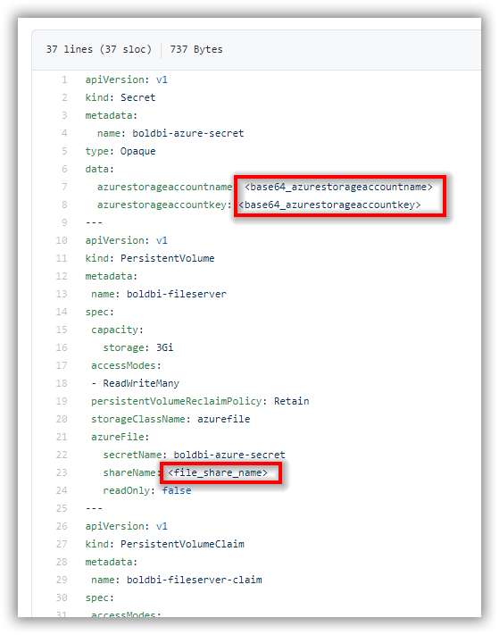
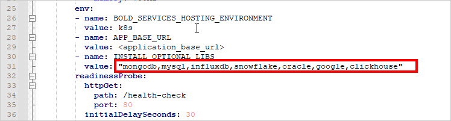
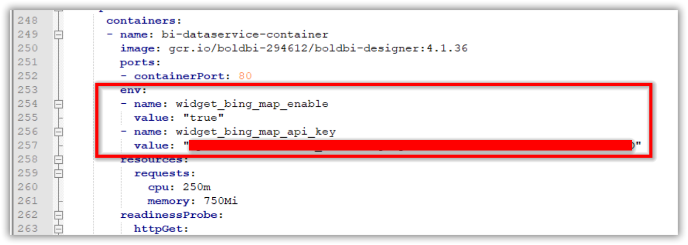

# Bold BI on Microsoft Azure Kubernetes Service
If you are upgrading Bold BI to 4.1.36, please follow the steps in this [link](upgrade.md).

For fresh installation, continue with the following steps to deploy Bold BI On-Premise in Microsoft Azure Kubernetes Service (AKS).

1. Download the following files for Bold BI deployment in AKS:

    * [namespace.yaml](https://raw.githubusercontent.com/boldbi/boldbi-kubernetes/v4.1.36/deploy/namespace.yaml)
	* [log4net_config.yaml](https://raw.githubusercontent.com/boldbi/boldbi-kubernetes/v4.1.36/deploy/log4net_config.yaml)
    * [pvclaim_aks.yaml](https://raw.githubusercontent.com/boldbi/boldbi-kubernetes/v4.1.36/deploy/pvclaim_aks.yaml)
    * [deployment.yaml](https://raw.githubusercontent.com/boldbi/boldbi-kubernetes/v4.1.36/deploy/deployment.yaml)
    * [hpa.yaml](https://raw.githubusercontent.com/boldbi/boldbi-kubernetes/v4.1.36/deploy/hpa.yaml)
    * [service.yaml](https://raw.githubusercontent.com/boldbi/boldbi-kubernetes/v4.1.36/deploy/service.yaml)
    * [ingress.yaml](https://raw.githubusercontent.com/boldbi/boldbi-kubernetes/v4.1.36/deploy/ingress.yaml)

2. Create a Kubernetes cluster in Microsoft Azure Kubernetes Service (AKS) to deploy Bold BI.

3. Create a File share instance in your storage account and note the File share name to store the shared folders for applications’ usage.

4. Encode the storage account name and storage key in base64 format.

5. Open **pvclaim_aks.yaml** file, downloaded in **Step 1**. Replace the **base64 encoded storage account name**, **base64 encoded storage account key**, and **File share name** noted in above steps to `<base64_azurestorageaccountname>`, `<base64_azurestorageaccountkey>`, and `<file_share_name>` places in the file respectively. You can also change the storage size in the YAML file.



6. Connect with your Microsoft AKS cluster.

7. After connecting with your cluster, deploy the latest Nginx ingress controller to your cluster using the following command.

```sh
kubectl apply -f https://raw.githubusercontent.com/kubernetes/ingress-nginx/controller-v0.41.2/deploy/static/provider/cloud/deploy.yaml
```

8. Navigate to the folder where the deployment files were downloaded from **Step 1**.

9. Run the following command to create the namespace for deploying Bold BI.

```sh
kubectl apply -f namespace.yaml
```

10. Run the following command to create the configmap..

```sh
kubectl apply -f log4net_config.yaml
```

11. If you have a DNS to map with the application, then you can continue with the following steps, else skip to **Step 15**. 

12. Open the **ingress.yaml** file. Uncomment the host value and replace your DNS hostname with `example.com` and save the file.

13. If you have the SSL certificate for your DNS and need to configure the site with your SSL certificate, follow the below step or you can skip to **Step 15**.

14. Run the following command to create a TLS secret with your SSL certificate.

```sh
kubectl create secret tls boldbi-tls -n boldbi --key <key-path> --cert <certificate-path>
```

15. Now, uncomment the `tls` section and replace your DNS hostname with `example.com` in ingress spec and save the file.


16. Run the following command for applying the Bold BI ingress to get the IP address of Nginx ingress.

```sh
kubectl apply -f ingress.yaml
```

17. Now, run the following command to get the ingress IP address.

```sh
kubectl get ingress -n boldbi
```
Repeat the above command till you get the IP address in ADDRESS tab as shown in the following image.
 

18. Note the ingress IP address and map it with your DNS, if you have added the DNS in **ingress.yaml** file. If you do not have the DNS and want to use the application, then you can use the ingress IP address.

19. Open the **deployment.yaml** file from the downloaded files in **Step 1**. Replace your DNS or ingress IP address in `<application_base_url>` place.
    
    Ex: `http://example.com`, `https://example.com`, `http://<ingress_ip_address>`

20. Read the optional client library license agreement from the following link.

    [Consent to deploy client libraries](../docs/consent-to-deploy-client-libraries.md)

21. Note the optional client libraries from the above link as comma separated names and replace it in `<comma_separated_library_names>` place. Save the file after the required values has been replaced.

 

22. If you need to use **Bing Map** widget feature, enter value for `widget_bing_map_enable` environment variable as `true` and API key value for `widget_bing_map_api_key` on **deployment.yaml** file.

     

23. Now, run the following commands one by one:

```sh
kubectl apply -f pvclaim_aks.yaml
```

```sh
kubectl apply -f deployment.yaml
```

```sh
kubectl apply -f hpa.yaml
```

```sh
kubectl apply -f service.yaml
```

24. Wait for some time till the Bold BI On-Premise application deployed to your Microsoft AKS cluster.

25. Use the following command to get the pods’ status.

```sh
kubectl get pods -n boldbi
```
 

26. Wait till you see the applications in running state. Then use your DNS or ingress IP address you got from **Step 16** to access the application in the browser.

27.	Configure the Bold BI On-Premise application startup to use the application. Please refer the following link for more details on configuring the application startup.
    
    https://help.boldbi.com/embedded-bi/application-startup