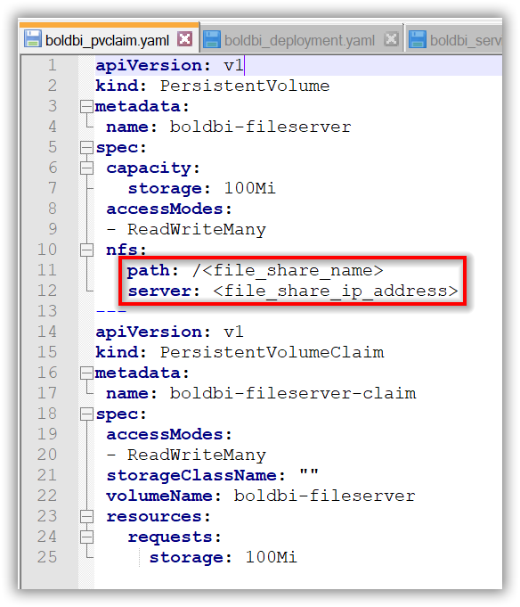

# Bold BI on Microsoft Azure Kubernetes Service
Please follow the below steps to deploy Bold BI On-Premise in Microsoft Azure Kubernetes Service (AKS).

1. Download the following files for Bold BI deployment in AKS,

    * [pvclaim_aks.yaml](../deploy/pvclaim_aks.yaml)
    * [deployment.yaml](../deploy/deployment.yaml)
    * [hpa.yaml](../deploy/hpa.yaml)
    * [service.yaml](../deploy/service.yaml)
    * [ingress.yaml](../deploy/ingress.yaml)

2. Create a Kubernetes cluster in Microsoft Azure Kubernetes Service (AKS) to deploy the Bold BI On-Premise application.

3. Create a File share instance in your storage account to store the shared folders for applications’ usage.

4. Note the following details after creating file share in your storage account,
    * File share name
    * base64 encoded storage account name
    * base64 encoded storage account key

5. Open **pvclaim_aks.yaml** file, downloaded in **step 1**. Replace the **File share name**, **base64 encoded storage account name** and **base64 encoded storage account key** noted in above step to the `<file_share_name>` and `<file_share_ip_address>` places in the file. You can also change the storage size in the YAML file. Save the file once you replaced the file share name and file share IP address.



6. Set your project and newly created cluster in Google cloud shell,
https://cloud.google.com/kubernetes-engine/docs/quickstart 

7. Deploy the latest Nginx ingress controller to your cluster using the following command,

```sh
kubectl apply -f https://raw.githubusercontent.com/kubernetes/ingress-nginx/controller-v0.41.2/deploy/static/provider/cloud/deploy.yaml
```

8. Navigate to the folder where the deployment files were downloaded from **Step 1**.

9. If you have a DNS to map with the application you can continue the following steps, else skip to **Step 15**. 

10. Open the **ingress.yaml** file. Uncomment the host value and replace your DNS hostname with `example.com` and save the file.

11. If you have the SSL certificate for your DNS and need to configure the site with your SSL certificate, follow the below step or you can skip to **Step 15**.

13. Run the following command to create a TLS secret with your SSL certificate,

```sh
kubectl create secret tls boldbi-tls --key <key-path> --cert <certificate-path>
```

14. Now uncomment the `tls` section and replace your DNS hostname with `example.com` in ingress spec and save the file.


15. Run the following command for applying the Bold BI ingress to get the IP address of nginx ingress,

```sh
kubectl apply -f ingress.yaml
```

16. Now run the following command to get the ingress IP address,

```sh
kubectl get ingress
```
Repeat the above command till you get the IP address in ADDRESS tab like in below image.
 

17. Note the ingress IP address and map it with your DNS if you have added the DNS in **ingress.yaml** file. If you do not have the DNS and want to use the application, you can use the ingress IP address.

18. Open the **deployment.yaml** file from the downloaded files on **step 1**. Replace your DNS or ingress IP address in `<application_base_url>` place.
    
    Ex: `http://example.com`, `https://example.com`, `http://<ingress_ip_address>`

19. Read the optional client library license agreement from the following link,
    [Consent to deploy client libraries](../docs/consent-to-deploy-client-libraries)

20. Note the optional client libraries from the above link as comma separated names and replace in `<comma_separated_library_names>` place. Save the file after the required values has been replaced.

 

21. Now run the following commands one by one,

```sh
kubectl apply -f pvclaim_aks.yaml
```

```sh
kubectl apply -f deployment.yaml
```

```sh
kubectl apply -f hpa.yaml
```

```sh
kubectl apply -f service.yaml
```

21. Now wait for some time to deploy the Bold BI On-Premise application in your Google Kubernetes cluster. 

22. Use the following command to get the pods’ status,

```sh
kubectl get pods
```
 

23.	Wait till you see all applications were in running state. Some applications may go get error and go to CrashLoopBackoff state. But they will change to Running state after some time.

24.	Then use the ingress IP address, you got on **step 9** to access the application in browser. The Bold BI On-Premise application will run on the ingress IP address.

25.	Configure the Bold BI On-Premise application startup to use the application. Please refer the following link for more details on configuring the application startup,
    https://help.boldbi.com/embedded-bi/application-startup