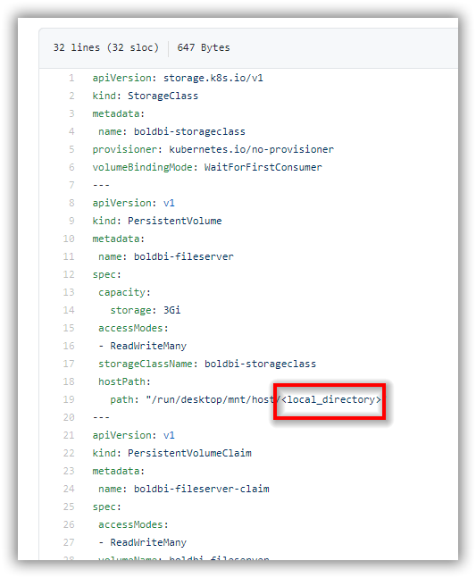

# Bold BI on On-Premise Kubernetes Cluster
If you are upgrading Bold BI to 4.1.36, please follow the steps in this [link](upgrade.md).

For fresh installation, continue with the following steps to deploy Bold BI application in your On-Premise machine kubernetes cluster.

1. Download the following files for Bold BI deployment in On-Premise:

    * [namespace.yaml](https://raw.githubusercontent.com/boldbi/boldbi-kubernetes/v4.1.36/deploy/namespace.yaml)
	* [log4net_config.yaml](https://raw.githubusercontent.com/boldbi/boldbi-kubernetes/v4.1.36/deploy/log4net_config.yaml)
    * [pvclaim_onpremise.yaml](https://raw.githubusercontent.com/boldbi/boldbi-kubernetes/v4.1.36/deploy/pvclaim_onpremise.yaml)
    * [deployment.yaml](https://raw.githubusercontent.com/boldbi/boldbi-kubernetes/v4.1.36/deploy/deployment.yaml)
    * [hpa.yaml](https://raw.githubusercontent.com/boldbi/boldbi-kubernetes/v4.1.36/deploy/hpa.yaml)
    * [service.yaml](https://raw.githubusercontent.com/boldbi/boldbi-kubernetes/v4.1.36/deploy/service.yaml)
    * [ingress.yaml](https://raw.githubusercontent.com/boldbi/boldbi-kubernetes/v4.1.36/deploy/ingress.yaml)

2. Create a folder in your machine to store the shared folders for applications’ usage.

    Ex: `D://app/shared`

3. Open **pvclaim_onpremise.yaml** file, downloaded in **Step 1**. Replace the shared folder path in your host machine to the `<local_directory>` place in the file. You can also change the storage size in the YAML file. 

    Ex: D://app/shared -> /run/desktop/mnt/host/**d/app/shared**



4. Deploy the latest Nginx ingress controller to your cluster using the following command.

```sh
kubectl apply -f https://raw.githubusercontent.com/kubernetes/ingress-nginx/controller-v0.41.2/deploy/static/provider/cloud/deploy.yaml
```

5. Map the DNS to your machine IP address, in which you want to access the application.

6. Navigate to the folder where the deployment files were downloaded from **Step 1**.

7. Run the following command to create the namespace for deploying Bold BI.

```sh
kubectl apply -f namespace.yaml
```

8. Run the following command to create the configmap..

```sh
kubectl apply -f log4net_config.yaml
```

9. Open the **ingress.yaml** file. Uncomment the host value and replace your DNS hostname with `example.com` and save the file.

10. If you have the SSL certificate for your DNS and need to configure the site with your SSL certificate, run the following command to create a TLS secret with your SSL certificate.

```sh
kubectl create secret tls boldbi-tls -n boldbi --key <key-path> --cert <certificate-path>
```

11. Now, uncomment the `tls` section and replace your DNS hostname with `example.com` in ingress spec and save the file.


12. Open the **deployment.yaml** file from the downloaded files in **Step 1**. Replace your DNS in `<application_base_url>` place.
    
    Ex: `http://example.com`, `https://example.com`

13. Read the optional client library license agreement from the following link.
    
    [Consent to deploy client libraries](../docs/consent-to-deploy-client-libraries.md)

14. Note the optional client libraries from the above link as comma separated names and replace it in `<comma_separated_library_names>` place. Save the file after the required values has been replaced.

 

15. If you need to use **Bing Map** widget feature, enter value for `widget_bing_map_enable` environment variable as `true` and API key value for `widget_bing_map_api_key` on **deployment.yaml** file.

     

16.	Now, run the following commands one by one:

```sh
kubectl apply -f pvclaim_onpremise.yaml
```

```sh
kubectl apply -f deployment.yaml
```

```sh
kubectl apply -f hpa.yaml
```

```sh
kubectl apply -f service.yaml
```

```sh
kubectl apply -f ingress.yaml
```

17.	Wait for some time till the Bold BI On-Premise application deployed to your On-Premise Kubernetes cluster. 

18.	Use the following command to get the pods’ status.

```sh
kubectl get pods -n boldbi
```
 

19. After deployment, wait for some time to Horizontal Pod Autoscaler (HPA) gets the metrics from the pods. Use the following command to get HPA status.

```sh
kubectl get hpa -n boldbi
```
If you get `<unknown>/80%` instead of actual CPU and memory usage of pods, then you do not have any metrics server running inside your cluster. Use the following command to deploy metrics server in your cluster to enable the autoscaling feature by HPA.
    
```sh
kubectl apply -f https://github.com/kubernetes-sigs/metrics-server/releases/download/v0.3.7/components.yaml
```

20.	Use your DNS hostname to access the application in the browser.

21.	Configure the Bold BI On-Premise application startup to use the application. Please refer the following link for more details on configuring the application startup.
    
    https://help.boldbi.com/embedded-bi/application-startup