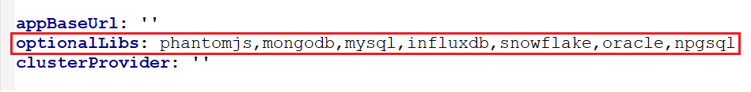
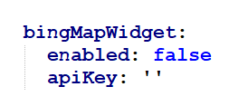

# Configuration

See [Customizing the Chart Before Installing](https://helm.sh/docs/intro/using_helm/#customizing-the-chart-before-installing).
To see all configurable options with detailed comments, visit the chart's [values.yaml](../boldbi/values.yaml), or run these configuration commands:

```console
# Helm 3
helm show values boldbi/boldbi
```

## Client Libraries

Read the optional client library license agreement from the following link.

[Consent to deploy client libraries](../docs/consent-to-deploy-client-libraries.md)

Note the optional client libraries from the above link as comma separated names and replace it like below.



## Bing Map Widget

If you need to use **Bing Map** widget feature, enable this to `true` and API key value for `widget_bing_map_api_key`.


